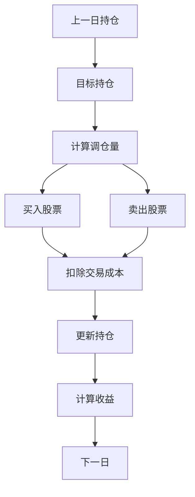

# 回测买卖逻辑详解

本文档详细描述当前回测系统的买卖逻辑、组合构建方式以及收益计算机制。

## 1. 当前实现：简化版回测

### 1.1 核心假设

当前回测系统采用**简化假设**，不涉及真实的买卖交易：

- ✅ **每日完美调仓**：假设每个交易日可以无成本、无延迟地调整到目标组合
- ✅ **使用标签收益**：收益计算基于 `Ref($close, -5)/$close - 1`（T+5 日收益），而非实际交易价格
- ✅ **无交易成本**：不考虑手续费、滑点、冲击成本
- ✅ **无持仓连续性**：每日独立构建组合，不考虑上一日持仓

### 1.2 回测流程

```python
# run_backtest.py 主循环（简化版）
for dt in sorted(pred_dates):
    # 1. 获取当日信号
    score = preds.xs(dt)  # final 列，MultiIndex(datetime, instrument)
    
    # 2. 获取当日标签收益（T+5 收益）
    label_slice = labels.xs(dt)
    
    # 3. 构建组合权重（无历史持仓信息）
    weights = builder.build(score, industry_slice, top_k=50)
    
    # 4. 计算当期收益（权重 × 标签收益）
    ret = (weights * label_slice).sum()
    
    # 5. 记录结果（不保存持仓状态）
    results.append({"date": dt, "return": ret})
```

## 2. 组合构建逻辑（PortfolioBuilder）

### 2.1 构建步骤


#### 步骤 1：信号排序与筛选

```python
# portfolio/portfolio_builder.py:36
filtered = scores.dropna().sort_values(ascending=False).head(top_k)
```

- **输入**：所有股票的 `final` 信号值
- **操作**：按信号降序排序，取前 `top_k` 只（默认 50）
- **输出**：候选股票池

#### 步骤 2：线性衰减权重分配

```python
# portfolio/portfolio_builder.py:37-38
ranks = filtered.rank(ascending=False, method="first")
weights = (top_k - ranks + 1) / top_k
```

**权重公式**：
- 第 1 名：`weight = (50 - 1 + 1) / 50 = 1.0`
- 第 2 名：`weight = (50 - 2 + 1) / 50 = 0.98`
- 第 50 名：`weight = (50 - 50 + 1) / 50 = 0.02`

**特点**：
- 信号越强，权重越高
- 权重线性递减，避免极端集中

#### 步骤 3：整体仓位控制

```python
# portfolio/portfolio_builder.py:40
weights = weights / weights.sum() * self.max_position
```

- **`max_position`**：默认 0.3（30% 仓位）
- **操作**：归一化后乘以仓位上限
- **结果**：总权重 = `max_position`，剩余 70% 为现金

#### 步骤 4：单股权重裁剪

```python
# portfolio/portfolio_builder.py:42-43
weights = weights.clip(upper=self.max_stock_weight)
weights = weights / weights.sum() * self.max_position
```

- **`max_stock_weight`**：默认 0.05（单股最多 5%）
- **操作**：裁剪超限权重，重新归一化
- **目的**：避免单股过度集中风险

#### 步骤 5：行业权重裁剪（可选）

```python
# portfolio/portfolio_builder.py:45-46
if industry_map is not None:
    weights = self._apply_industry_constraint(weights, industry_map)
```

**行业约束逻辑**：
```python
# portfolio/portfolio_builder.py:51-63
for industry, group in industries.groupby(industries):
    total = constrained.loc[idx].sum()
    if total > self.max_industry_weight:  # 默认 0.2 (20%)
        scale = limit / total
        constrained.loc[idx] *= scale  # 等比例压缩
```

- **`max_industry_weight`**：默认 0.2（单行业最多 20%）
- **操作**：按行业分组，超限则等比例压缩
- **目的**：控制行业集中度风险

### 2.2 权重分配示例

假设 `top_k=50`, `max_position=0.3`, `max_stock_weight=0.05`：

| 排名 | 信号值 | 初始权重 | 仓位调整后 | 单股裁剪后 | 最终权重 |
|------|--------|----------|------------|------------|----------|
| 1    | 0.85   | 1.00     | 0.006      | 0.015      | 0.015    |
| 2    | 0.82   | 0.98     | 0.0059     | 0.015      | 0.015    |
| ...  | ...    | ...      | ...        | ...        | ...      |
| 50   | 0.15   | 0.02     | 0.00012    | 0.00012    | 0.00012  |
| **合计** | - | 50.0 | **0.3** | **0.3** | **0.3** |

## 3. 收益计算逻辑

### 3.1 当期收益

```python
# run_backtest.py:113
ret = (weights.loc[realized.index] * realized).sum()
```

**公式**：
```
return_t = Σ(weight_i × label_i)
```

其中：
- `weight_i`：股票 i 的权重
- `label_i`：股票 i 的标签收益 = `Ref($close, -5)/$close - 1`（T+5 日收益）

### 3.2 累计收益

```python
# run_backtest.py:133
df["cum_return"] = (1 + df["return"]).cumprod() - 1
```

**公式**：
```
cum_return_t = Π(1 + return_i) - 1  (i = 1 to t)
```

### 3.3 收益计算的特点

**当前实现的问题**：

1. **时间不匹配**：
   - 信号生成时间：T 日
   - 收益计算时间：T+5 日（标签收益）
   - **实际应该是**：T 日买入，T+1 日卖出，使用 T+1 日收益

2. **无持仓连续性**：
   - 每日独立构建，不考虑上一日持仓
   - 无法计算真实的换手率

3. **无交易成本**：
   - 假设调仓无成本
   - 实际应扣除手续费、滑点

## 4. 买卖逻辑的缺失

### 4.1 当前实现：无真实买卖

当前回测**没有真正的买卖逻辑**，只有：

1. **每日重新构建组合**：根据当日信号生成目标权重
2. **假设完美调仓**：直接使用目标权重计算收益
3. **无持仓状态**：不记录上一日持仓，无法计算调仓量

### 4.2 真实买卖逻辑应该包含



**关键步骤**：

1. **持仓状态管理**：
   ```python
   # 伪代码
   prev_holdings = {stock: weight for stock, weight in prev_weights}
   target_holdings = {stock: weight for stock, weight in target_weights}
   ```

2. **调仓量计算**：
   ```python
   # 伪代码
   trades = {}
   for stock in all_stocks:
       prev_weight = prev_holdings.get(stock, 0)
       target_weight = target_holdings.get(stock, 0)
       trades[stock] = target_weight - prev_weight  # 正数=买入，负数=卖出
   ```

3. **交易成本**：
   ```python
   # 伪代码
   turnover = sum(abs(trades.values()))  # 换手率
   cost = turnover * commission_rate  # 手续费
   slippage = turnover * slippage_rate  # 滑点
   total_cost = cost + slippage
   ```

4. **收益计算**：
   ```python
   # 伪代码
   # 使用 T+1 收益（买入后次日卖出）
   next_day_return = get_return(t+1)
   gross_return = sum(prev_weights * next_day_return)
   net_return = gross_return - total_cost
   ```

## 5. 改进建议

### 5.1 短期改进（保持简化假设）

1. **修正收益时间**：
   ```python
   # 当前：使用 T+5 收益（标签收益）
   # 建议：使用 T+1 收益（更符合交易逻辑）
   next_day_labels = labels.shift(-1)  # 下移一天
   ret = (weights * next_day_labels.xs(dt)).sum()
   ```

2. **添加换手率统计**：
   ```python
   # 计算每日换手率（即使无真实持仓）
   if prev_weights is not None:
       turnover = sum(abs(target_weights - prev_weights)) / 2
   ```

### 5.2 长期改进（真实交易回测）

1. **引入持仓状态**：
   ```python
   class BacktestEngine:
       def __init__(self):
           self.holdings = {}  # {stock: shares}
           self.cash = 1.0  # 现金
   ```

2. **实现买卖逻辑**：
   ```python
   def rebalance(self, target_weights, prices, commission=0.001):
       # 计算目标持仓
       target_value = self.total_value * target_weights
       target_shares = target_value / prices
       
       # 计算调仓
       trades = target_shares - self.holdings
       
       # 执行交易（考虑成本）
       for stock, shares in trades.items():
           if shares > 0:  # 买入
               cost = shares * prices[stock] * (1 + commission)
               self.cash -= cost
               self.holdings[stock] += shares
           else:  # 卖出
               revenue = abs(shares) * prices[stock] * (1 - commission)
               self.cash += revenue
               self.holdings[stock] += abs(shares)
   ```

3. **使用真实价格**：
   ```python
   # 使用 qlib 获取 T+1 开盘价/收盘价
   from qlib.data import D
   prices = D.features(instruments, fields=["$open", "$close"], ...)
   ```

## 6. 当前回测的适用场景

### 6.1 适用场景

- ✅ **信号有效性验证**：快速验证模型预测是否有效
- ✅ **相对收益评估**：比较不同模型/策略的相对表现
- ✅ **参数调优**：快速迭代组合构建参数（top_k, max_position 等）

### 6.2 不适用场景

- ❌ **绝对收益评估**：无法评估真实交易收益
- ❌ **风险控制**：无法评估真实换手率、交易成本
- ❌ **实盘部署**：需要额外的交易执行逻辑

## 7. 代码位置总结

| 功能 | 文件 | 关键代码行 |
|------|------|-----------|
| 回测主循环 | `run_backtest.py` | 100-114 |
| 组合构建 | `portfolio/portfolio_builder.py` | 28-49 |
| 行业约束 | `portfolio/portfolio_builder.py` | 51-63 |
| 收益计算 | `run_backtest.py` | 113, 133 |
| 明细记录 | `run_backtest.py` | 115-125 |

## 8. 总结

当前回测系统是一个**简化版本**，核心特点：

1. **每日独立构建组合**：根据当日信号重新分配权重
2. **无真实买卖**：假设完美调仓，无交易成本
3. **使用标签收益**：基于 T+5 收益计算，而非实际交易收益
4. **无持仓状态**：不记录历史持仓，无法计算换手

**优势**：快速、简单，适合信号验证和参数调优

**局限**：无法评估真实交易表现，需要改进才能用于实盘评估

如需真实交易回测，建议参考 Qlib 内置的 `backtest` 模块或实现上述改进建议。

