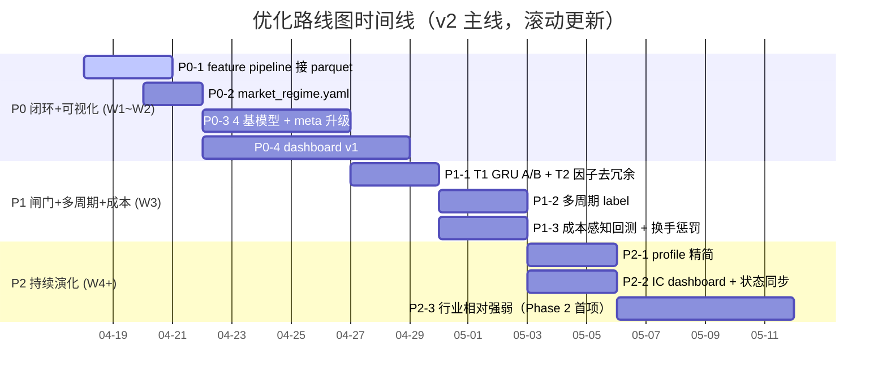
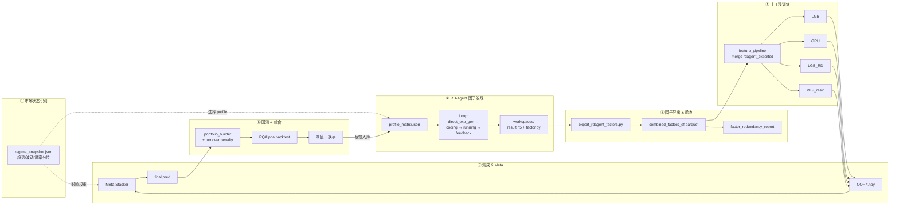

# 量化工程优化路线图（2026）

> **文档性质**：项目级目标与实施路线约定。后续迭代（因子、模型、训练、回测、RD-Agent、监控）以本文件为优先级与范围基准；重大偏离需在 PR/变更说明中写明理由。

**制定日期**：2026-04-17  
**v2 重订日期**：2026-04-17（同日晚修订，本文档**以 v2 为主**）  
**关联现状**：Qlib 主链路 + LGB/GRU + 动态 IC 加权 + OOF/Ridge（见 `docs/CHANGELOG_2026-01-14.md`）；RQAlpha T+1 回测；RD-Agent 因子实验。

---

## 零、v2 重订总览（主线，优先级高于 v1 Phase 1~5）

> 本节为本路线图的**主线**。v1（2026-04-17 初版）的 Phase 1~5 结构保留在正文，但已统一降级为"子项"或"已合并动作"，映射关系见 0.3；当 v1 与 v2 表述冲突时以 v2 为准。

### 0.1 触发原因（为什么要 v2）

重新对齐工程**初衷**："**用 RD-Agent 挖因子 + Qlib 训练 → 得到适配当前市场的模型组合**"之后，识别出 5 个当前瓶颈，优先级排序如下：

1. **闭环断裂（最关键）**：RD-Agent 产出的 `git_ignore_folder/combined_factors_df.parquet` 只在 `rdagent_overrides/factor_template/conf_combined_factors.yaml` 的 qrun 沙箱里生效；主工程 `run_train.py → trainer/trainer.py → feature/qlib_feature_pipeline.py` **从未读入过这个文件**（全项目搜索已确认）。RD-Agent 再挖多少轮，都不会进入生产模型组合。
2. **"当前市场"没有落成配置**：`config/data.yaml` 的窗口与 `pipeline.yaml.rolling.model_train_days` 之间关系靠 preflight 的软说明维持；不存在一个显式的 regime 描述文件，"适合当前市场的组合" 缺少可度量标尺。
3. **模型组合过薄**：`base_models: ["lgb", "gru"]`，MLP 已停用、Stack 不独立；`dynamic_weighted` 在 2 个模型上近似胜者全拿；meta-stacker 的 Ridge 在 2 列输入下几乎是线性加权。
4. **Phase 1 闸门未闭环**（v1 自带的 T1 GRU A/B、T2 因子去冗余两项 DoD 未达成）。
5. **回测偏乐观**：`portfolio/` 无换手惩罚；RQAlpha 侧 0.03%+0.01% 低于 A 股小单真实成本；ensemble 权重翻转引发的换手爆炸未被惩罚。
6. **过程不可视化**：训练/RD-Agent/回测的状态散落在 `data/logs/`、`log/<ts>/`、`run_artifacts/`、`data/tuning/`，缺少"一眼看明白当前在做什么、下一步是什么"的中央仪表盘（详见第十一节）。

### 0.2 v2 Phase 结构


| Phase  | 主题                             | 状态        | 时间    | 产物/验收                                                                                         |
| ------ | ------------------------------ | --------- | ----- | --------------------------------------------------------------------------------------------- |
| **P0** | 闭环打通 + 市场口径 + 组合扩容 + 可视化仪表盘    | 进行中（本次立项） | W1~W2 | 主工程能吃 `combined_factors_df.parquet`；`market_regime.yaml` 落地；`base_models` 扩到 4 个；dashboard v1 |
| **P1** | 闸门收尾 + 多周期 label + 成本回测        | 待启动       | W3    | T1/T2 结论回填 2.5.3；labels 支持 list；RQAlpha 成本翻倍下仍正超额                                             |
| **P2** | Profile 精简 + 持续演化 + Phase 2 子项 | 待启动       | W4~   | A/B/D profile 稳定产出；新增行业相对强弱一类因子通过 9.2 门槛                                                      |


### 0.3 P0/P1/P2 行动清单（每条指向具体文件）


| ID   | 动作                                                                                           | 文件/路径                                                                                                                                                                            | 验收信号                                                                                                                                                       |
| ---- | -------------------------------------------------------------------------------------------- | -------------------------------------------------------------------------------------------------------------------------------------------------------------------------------- | ---------------------------------------------------------------------------------------------------------------------------------------------------------- |
| P0-1 | **打通 rdagent → 主工程训练闭环**（✅ 已完成 2026-04-18，见 `[docs/P0-1_RUN_GUIDE.md](./P0-1_RUN_GUIDE.md)`） | `feature/qlib_feature_pipeline.py` 新增 `rdagent_exported` 分支；`config/data.yaml.feature_sets` 加占位组；配套 `scripts/refresh_rdagent_parquet.py` + `smoke_p01.py` + `smoke_p01_train.py` | ✅ `run_train.py` 在 `active_feature_sets` 含 `rdagent_exported` 时能 merge parquet 并正常训练；当前 parquet 覆盖 `2020-01-02 ~ 2026-04-07` × 799 只（csi500+csi300）× 14 因子 |
| P0-2 | **"当前市场"显式化**                                                                                | 新建 `config/market_regime.yaml`；`scripts/sync_regime_snapshot.py`（新增）                                                                                                             | 每次 report 顶部打印 regime 分位与目标函数口径                                                                                                                            |
| P0-3 | **模型组合扩到 4 个**                                                                               | `config/pipeline.yaml.base_models` = `["lgb", "lgb_rd", "gru", "mlp_resid"]`；`models/` 新增 `mlp_resid`（残差学习）；meta-stacker 升级为 ElasticNet / LGBM-meta                              | OOF 4 列齐全；meta 权重在 4 列输入下 IC 提升可观察（日志有明确记录）                                                                                                                |
| P0-4 | **可视化仪表盘 v1**                                                                                | 新建 `scripts/render_pipeline_dashboard.py`；`data/dashboard/index.html`；详见第十一节                                                                                                     | `index.html` 能聚合 regime / rdagent / factor_pool / train / ensemble / backtest 6 个块                                                                         |
| P1-1 | Phase 1 闸门 T1（GRU A/B）+ T2（因子去冗余）                                                            | `scripts/tuning_pipeline.py --only gru`；`scripts/factor_redundancy_report.py`                                                                                                    | `data/gru_ab/ab_summary.md` 与 `data/factor_analysis/redundancy_report_LATEST.md` 生成；结论回填 2.5.3                                                             |
| P1-2 | 多周期 label（3 日 + 10 日并行）                                                                      | `config/data.yaml.label` 改为 list；`trainer/trainer.py.label_future_days` 处理 list 取 max                                                                                            | 两路 label 的 OOF 列都进入 meta 输入；日志首行显示 `label_future_days=10`                                                                                                  |
| P1-3 | 成本感知回测 + 换手惩罚                                                                                | `config/rqalpha_config.yaml` 手续费/滑点翻倍；`portfolio/portfolio_builder.py` 增 `turnover_penalty`                                                                                      | 双倍成本下 ensemble 仍正超额；日均换手下降 ≥ 30%                                                                                                                           |
| P2-1 | RD-Agent profile 精简（暂停 C，强化 A/B/D）                                                           | `config/rdagent_profile_matrix.json`；`scripts/run_rdagent_profile_matrix.ps1`                                                                                                    | A+B 先跑，B 通过 9.2 门槛的因子才触发 D；C 归档等待 Phase 5                                                                                                                  |
| P2-2 | IC dashboard + roadmap 状态自动同步                                                                | `scripts/render_ic_dashboard.py`（v1 节 10.2 已规划）；`scripts/sync_roadmap_status.py`                                                                                                 | `data/ic_dashboard/ic_dashboard.html`；2.5.1 表格自动注入"Last artifact"                                                                                          |
| P2-3 | Phase 2 第一个子项：行业相对强弱                                                                         | `config/data.yaml.feature_sets` 新 set；按 v1 附录 9.2 验收                                                                                                                             | 新因子簇中 ≥ 1 个进入 `active_feature_sets` 且不劣化小盘 ICIR                                                                                                            |


### 0.4 与 v1 Phase 的映射关系


| v1                                  | v2                 | 说明                                                |
| ----------------------------------- | ------------------ | ------------------------------------------------- |
| v1 Phase 1 T1/T2                    | **P1-1**           | 闸门延续，两项 DoD 不变；只是整体归位到 P1，而不再是"启动 v1 Phase 2 的前置" |
| v1 Phase 1 T3（label_future_days 正则） | **已完成**（v1 附录 8.5） | v2 不动                                             |
| v1 Phase 1 T4（因子精简集决策）              | 归入 **P1-1 后半段**    | T2 报告产出后人工决策，更新 `active_feature_sets`             |
| v1 Phase 2（因子体系扩展）                  | **P2-3** + v1 附录九  | v1 附录九的 A/B 子项并入 P2-3；v2 下为 Phase 2 第一次"窄范围"落地    |
| v1 Phase 3（模型与集成升级）                 | **P0-3 + P1-2**    | 模型组合扩容 + 多周期 label + meta 升级合并为 v2 的 P0-3、P1-2    |
| v1 Phase 4（回测与组合可执行性）               | **P1-3**           | 换手惩罚 + 成本翻倍；组合优化（cvxpy 等）延后至 Phase 后的单独主题         |
| v1 Phase 5（RD-Agent 持续演化）           | **P2-1**           | Profile 精简是"持续演化"的第一步；失败诊断、种子库在 Phase 5 专项继续      |
| v1 第十节（可视化增强计划）                     | **P0-4 + 第十一节**    | 升级为 Dashboard 主线；v1 第十节的 HTML 改造点作为子任务归入第十一节设计    |


### 0.5 v2 四周节奏（可直接照着做）


| 周   | 主要交付                                                       | 验收信号                                                                         |
| --- | ---------------------------------------------------------- | ---------------------------------------------------------------------------- |
| W1  | P0-1（feature pipeline 接 parquet）+ P0-2（regime 落地）+ P0-4 骨架 | 主工程能加载 `rdagent_exported`；`index.html` 能打开并显示市场状态卡 + pipeline 阶段灯            |
| W2  | P0-3（扩到 4 基模型 + meta 升级）+ P0-4 子页                          | 4 个基模型 OOF 齐全；6 个子页（regime/rdagent/factor_pool/train/ensemble/backtest）全部可跳转 |
| W3  | P1-1（T1/T2 闸门）+ P1-2（多周期 label）+ P1-3（成本回测）                | `ab_summary.md`、`redundancy_report_LATEST.md` 生成；双倍成本下 ensemble 仍正超额         |
| W4  | P2-1（profile 精简）+ P2-2（IC dashboard + 状态同步）+ P2-3（行业相对强弱）  | A+B 稳定；`ic_dashboard.html` 可用；新因子簇进入 `active_feature_sets`                   |


---

## 一、总体目标

在**不无限扩 scope** 的前提下，达成三条主线：

1. **流程更丝滑**：训练—评估—消融—导出—回测—监控形成可重复、可诊断的闭环；失败可定位（日志、产物、preflight）。
2. **因子更可实战**：从「堆表达式」转向「正交化、可解释、可换手约束」的因子集；新因子需经 IC/ICIR/衰减/换手门槛。
3. **模型与组合更稳健**：缓解 GRU 窗口 IC 波动；集成与 meta 层能反映「何时信谁」；回测假设向真实成本与可执行性靠拢。

---

## 二、当前基线与已知问题（摘要）


| 维度   | 现状                                                              | 主要风险/缺口                            |
| ---- | --------------------------------------------------------------- | ---------------------------------- |
| 特征   | `config/data.yaml` 多组 `feature_sets`，`active_feature_sets` 五组并用 | 组间重复度高，信息增量有限                      |
| 标签   | `label: Ref($close_qfq, -3)/Ref($close_qfq, 1) - 1`             | 单一持有期视角                            |
| 模型   | `config/pipeline.yaml`：`lgb` + `gru`，`dynamic_weighted`         | 验证窗内 GRU IC 多窗偏弱或波动                |
| 因子挖掘 | RD-Agent + `scripts/export_rdagent_factors.py`                  | 深度 profile 曾出现全任务失败；与主工程标签/路径需严格对齐 |
| 实验   | `data/tuning/` 等                                                | 部分实验 `metrics_csv_missing`，消融结论不可靠 |
| 回测   | RQAlpha + 简化回测                                                  | 需强化成本、换手、冲击与组合约束下的可执行性             |


---

## 二点五、进度总览（Live）

> 本节随每次 Phase 收尾/调整更新；当"状态/下一动作"与正文不一致，以本表为准。

### 2.5.1 Phase 状态看板


| Phase         | 主题                              | 状态                           | 起止（计划）             | 下一动作                                                                      |
| ------------- | ------------------------------- | ---------------------------- | ------------------ | ------------------------------------------------------------------------- |
| **P0**（v2 主线） | 闭环打通 + 市场口径 + 组合扩容 + 可视化仪表盘     | **进行中（新立项，W1~W2）**           | 2026-04-18 ~ 05-01 | 先做 P0-1（feature pipeline 接 parquet），然后 P0-2 / P0-3 / P0-4 并行推进（详见第零节 0.3） |
| Phase 1       | 工程与因子基础（v1 原主线，现降级为 P1-1 闸门）    | **T3 已完成；T1/T2 归入 P1-1 待触发** | 2026-04-17 ~ 04-20 | 待 P0 完成后进入 W3 一起跑 T1 + T2                                                 |
| Phase 2       | 因子体系扩展（v1 原主线，现归入 P2-3）         | 待启动（预计 1~2 个子项落地）            | 2026-05-08 后       | 按附录九的窄范围方案启动第一个子项（行业相对强弱）                                                 |
| Phase 3       | 模型与集成升级（v1 原主线，现并入 P0-3 / P1-2） | 并入 v2                        | 与 P0-3 / P1-2 同步推进 | —                                                                         |
| Phase 4       | 回测与组合可执行性（v1 原主线，现并入 P1-3）      | 并入 v2                        | 与 P1-3 同步          | —                                                                         |
| Phase 5       | RD-Agent 持续演化（v1 原主线，现并入 P2-1）  | 并入 v2                        | 与 P2-1 / P2-2 并行推进 | 先做 `run_artifacts` 失败分类                                                   |


### 2.5.2 甘特图




### 2.5.3 Phase 1 收尾 TODO（按此顺序执行）


| #   | 任务                                                                | 触发者                | Definition of Done                                                                                                                |
| --- | ----------------------------------------------------------------- | ------------------ | --------------------------------------------------------------------------------------------------------------------------------- |
| T1  | 正式跑 GRU A/B（`gru_attention_none` vs `gru_attention_self`）         | 用户本地               | `data/gru_ab/ab_summary.md` 生成；结论拷贝到附录七的"GRU A/B 结论"小节                                                                            |
| T2  | 跑一次因子去冗余报告 + 排查 F056 全 NaN 根因                                     | 用户本地               | `data/factor_analysis/redundancy_report_LATEST.md` 生成；F056 对应表达式与字段缺失原因写入附录八                                                      |
| T3  | 修正 `trainer/trainer.py` 的 `label_future_days` 正则（兼容 `$close_qfq`） | **已交付（代码 + 单元验证）** | 正则扩展为 `Ref\(\s*\$[A-Za-z_][A-Za-z0-9_]*\s*,\s*-(\d+)\s*\)`（取 max N）；当前 label 下 `label_future_days=3`；详见附录 8.5。A/B 验收随 T1 实际训练日志确认 |
| T4  | 采纳因子精简集决策（接受 / 保留原集 / 合并）                                         | 用户                 | 决定记入附录八 2.5.4；如采纳，更新 `config/data.yaml.active_feature_sets` 并在 commit message 标注                                                  |
| T5  | Phase 2 启动前 freeze                                                | 代码改动               | 把本表四项产物状态写回 2.5.1 Phase 1 行（状态改 "已完成"）后，才允许启动 Phase 2                                                                             |


> 这一节是 Phase 1 与 Phase 2 之间的闸门；未完成 T1~T5 不进入 Phase 2。

### 2.5.4 产物索引（便于导航与审计）


| 产物         | 路径                                                                                                                    |
| ---------- | --------------------------------------------------------------------------------------------------------------------- |
| GRU A/B 报告 | `data/gru_ab/ab_summary.{md,json}` + `ic_gru_curve.png`                                                               |
| 因子去冗余报告    | `data/factor_analysis/redundancy_report_{ts}.{csv,md,json}` + `corr_heatmap_{ts}.png` + `redundancy_report_LATEST.md` |
| Tuning 汇总  | `data/tuning/summary/*.csv` + `tuning_report.html`（HTML 内含"失败原因汇总"区块）                                                 |
| 训练滚动 IC    | `data/logs/{pool}_logs/training_metrics.csv`                                                                          |
| 模型 & OOF   | `data/models/`、`data/oof/`、`data/meta/`                                                                               |
| RQAlpha 回测 | `data/backtest/rqalpha/{pool}/detailed_results.json`                                                                  |


---

## 三、分阶段路线图（必须按序推进的核心交付）

### Phase 1：工程与因子基础（约 1～2 周）

**目标**：清技术债，让「跑通 + 可度量」成为默认状态。

- **消融/调参流水线**：修复 metrics 未落盘、路径与配置传递问题；增加 preflight（数据窗口、特征集、输出目录可写）。
- **因子去冗余**：按截面 Rank 相关或滚动相关聚类，阈值（建议 0.7～0.9）可配置；每簇保留 IC/ICIR 更优代表或保留与树模型重要性一致的子集。
- **GRU 稳定性**：优先启用已有注意力/时序聚合能力（如 `config/model_gru.yaml` 中与 `_GRUNetWithAttention` 对应的开关，以实际代码为准），避免仅依赖最后一步 hidden。
- **文档与配置一致性**：主工程 `data.yaml` 标签、RD-Agent 导出脚本中的 label 构造、`rdagent_overrides` 模板三者统一口径，避免评估漂移。

**验收**：一次完整 ablation/tuning 运行可生成可读 metrics；训练日志中 GRU 负 IC 窗口数量相对基线下降或波动收窄（以 `data/logs/*/training_metrics.csv` 对比）。

---

### Phase 2：因子体系扩展（约 2～3 周）

**目标**：增加对实战有意义、与现有动量/波动/量价低相关的因子类别。

优先方向（需在 Qlib 字段与合规数据源范围内落地）：

- 行业/市值中性化的相对强弱（收益、换手、资金流相对截面）。
- 资金流持续性、大单占比变化率（在已有 `buy_*_amount`、`net_amount` 等字段上扩展）。
- 流动性与冲击代理（如 Amihud 类、成交额缩放后的量价冲击）。
- 波动结构（上行/下行 realized vol 不对称、短期/长期波动比）。

**验收**：新增因子均具备「日频 IC、滚动 ICIR、衰减曲线、多空分层、换手」报告；默认准入建议：`|Rank IC|` 与 ICIR 联合门槛 + 缺失率上限（可参考 `export_rdagent_factors.py` 思路扩展到全库因子）。

---

### Phase 3：模型与集成升级（约 2～3 周）

**目标**：多尺度信号 + 更聪明的集成，而不是堆更多树或更深网络。

- **多任务/多标签**（可选辅任务）：在统一表示下同时预测 1/3/5 日（或波动）等，辅任务作正则；具体标签定义以不引入未来函数为前提，写入 `config/data.yaml` 并贯通 `feature`/`trainer`。
- **市场状态感知**（轻量）：以波动、宽基趋势、成交量分位等构造 regime 特征，用于动态权重或 meta 输入。
- **Meta-Learner 升级**：在 OOF 基础上，meta 输入除 `lgb_pred`、`gru_pred` 外，增加 regime 与近期 IC 可信度特征；模型形式从 Ridge 起步，必要时再到 GBDT meta（控制过拟合）。

**验收**：验证集与样本外（滚动窗）上集成 Rank IC 与回测指标相对 Phase 1 基线有提升，或同等收益下回撤/换手更优。

---

### Phase 4：回测与组合可执行性（约 1～2 周）

**目标**：纸面收益让位于「可下单、可复盘」。

- **成本模型**：佣金、印花税、滑点（可与振幅/成交量挂钩）、冲击（可选）在 `config/rqalpha_config.yaml` 或策略层显式化。
- **组合优化**：在 `portfolio/` 侧引入换手惩罚与权重/行业偏离约束（可用 cvxpy 等）；输出与现有 Top-K 流程对齐。
- **多尺度信号融合规则**：信号冲突时降仓或延迟调仓（规则需可测试、可配置）。

**验收**：同一预测输入下，「约束组合 + 真实成本」回测仍具正超额或风险调整后可接受；生成可审计的成交与换手报表。

---

### Phase 5：RD-Agent 与持续演化（持续）

**目标**：自动挖因子从「能跑」到「稳定产出可合并因子」。

- **失败诊断**：对 `run_artifacts` 全链路日志分类（语法、数据、超时、环境）。
- **因子种子库**：高质量表达式/伪代码种子，约束 LLM 在有效流形上变异。
- **闭环**：生成 → 快速 IC 筛选 → 入库/淘汰 → 再提示；与 `combined_factors_df.parquet` 合并流程一致。

**验收**：`C_deep_factor_explore` 类 profile 连续多次运行成功率可接受，且导出因子经 Phase 2 门槛后可进入训练。

---

## 四、Quick Win（可与 Phase 1 并行）

1. 配置层启用 GRU 注意力/改进时序聚合（若当前默认关闭）。
2. 对 `active_feature_sets` 内表达式做相关矩阵剪枝（脚本化，一次一报告）。
3. 在 `data.yaml` 增加少量低耦合、可解释的行业相对或资金流衍生（先小步验证再扩面）。

---

## 五、变更治理

- **以本路线图为准**：功能 PR 应标明所属 Phase；跨 Phase 的大改需先更新本节或新增附录说明。
- **禁止 silent drift**：标签、归一化、预测列名、回测假设变更必须落在配置或本文件附录，并指向具体 commit/日期。
- **指标口径**：Rank IC 默认与 `predictor/weight_dynamic.py`、训练日志一致；因子筛选与导出脚本的 label 必须与 `config/data.yaml` 对齐。

---

## 六、附录：关键路径索引


| 用途          | 路径                                                   |
| ----------- | ---------------------------------------------------- |
| 数据与特征       | `config/data.yaml`                                   |
| 训练与滚动       | `config/pipeline.yaml`，`trainer/trainer.py`          |
| GRU         | `models/gru_model.py`，`config/model_gru.yaml`        |
| 动态加权        | `predictor/weight_dynamic.py`                        |
| RD-Agent 导出 | `scripts/export_rdagent_factors.py`                  |
| 组合          | `portfolio/portfolio_builder.py`                     |
| RQAlpha     | `config/rqalpha_config.yaml`，`backtest/rqalpha_*.py` |
| Profile 矩阵  | `config/rdagent_profile_matrix.json`                 |


---

## 七、附录：Phase 1 交付清单（2026-04-17）

本次 Phase 1 一次性交付的变更摘要：

### 新增文件

- [scripts/factor_redundancy_report.py](../scripts/factor_redundancy_report.py)：因子去冗余分析，输出 `data/factor_analysis/redundancy_report_{ts}.{csv,md,json}` 与可选 `corr_heatmap_{ts}.png`；只产报告，不改 `config/data.yaml`。
- [scripts/gru_ab_analyze.py](../scripts/gru_ab_analyze.py)：读取 A/B 两个 run 的 `logs/training_metrics.csv`，产出 `data/gru_ab/ab_summary.{md,json}` 与 `ic_gru_curve.png`。
- [data/tuning/specs/gru_attention_ab.yaml](../data/tuning/specs/gru_attention_ab.yaml)：GRU `attention_type` A/B 实验规格（`none` vs `self_attention`）。

### 修改文件

- [scripts/run_tuning_experiments.py](../scripts/run_tuning_experiments.py)：新增 `preflight_check`（provider_uri、日期顺序、active_feature_sets 引用、时间窗口充足性、label 存在性）；失败时写入 `result.json.error_tail`（stderr/stdout 末尾 40 行）。
- [scripts/collect_tuning_results.py](../scripts/collect_tuning_results.py)：`experiment_summary.csv` 新增 `preflight`、`preflight_failures`、`error_tail` 三列（截断到 500 字符）。
- [scripts/render_tuning_report.py](../scripts/render_tuning_report.py)：HTML 报告新增"失败原因汇总"区块，按异常签名聚类。
- [scripts/export_rdagent_factors.py](../scripts/export_rdagent_factors.py)：`_make_label` 由 `close[t+2]/close[t+1]-1` 调整为 `close[t+3]/close[t-1]-1`，与 `config/data.yaml` 主工程 label 一致。
- [feature/qlib_feature_pipeline.py](../feature/qlib_feature_pipeline.py)：顶部 docstring 与 `label_expr` 默认值更新为 `Ref($close_qfq, -3)/Ref($close_qfq, 1) - 1`。
- [trainer/trainer.py](../trainer/trainer.py)：`label_expr` 默认值同步更新；在 `label_future_days` 解析处标注已知 regex 局限（见下一节"遗留事项"）。
- [rdagent_overrides/factor_template/conf_baseline.yaml](../rdagent_overrides/factor_template/conf_baseline.yaml)、[rdagent_overrides/factor_template/conf_combined_factors.yaml](../rdagent_overrides/factor_template/conf_combined_factors.yaml)、[rdagent_overrides/factor_template/conf_combined_factors_sota_model.yaml](../rdagent_overrides/factor_template/conf_combined_factors_sota_model.yaml)、[rdagent_overrides/model_template/conf_sota_factors_model.yaml](../rdagent_overrides/model_template/conf_sota_factors_model.yaml)：`LABEL0` 统一为 3 日远期相对收益，与主工程 label 对齐。
- [README.md](../README.md)、[docs/WORKFLOW.md](./WORKFLOW.md)、[docs/FEATURE_GUIDE.md](./FEATURE_GUIDE.md)、[docs/BACKTEST_LOGIC.md](./BACKTEST_LOGIC.md)、[docs/TARGET_AND_LOSS_OPTIMIZATION.md](./TARGET_AND_LOSS_OPTIMIZATION.md)、[docs/IMPROVEMENT_SUGGESTIONS.md](./IMPROVEMENT_SUGGESTIONS.md)：标签描述与配置口径对齐（保留一处显式标注为"历史版本"的旧串，便于追溯）。

### 不改动（依路线图确认）

- `config/data.yaml`、`config/pipeline.yaml`、`config/model_gru.yaml`：本阶段不动训练/特征配置，避免影响历史指标的可比性。

### 验收与运行指令

```bash
# 1) tuning preflight 生效验证（非 dry-run 会真正训练，默认先跑 dry-run）
python scripts/tuning_pipeline.py \
  --spec data/tuning/specs/gru_attention_ab.yaml \
  --runs-dir data/tuning/runs_gru_ab \
  --summary-dir data/tuning/summary_gru_ab \
  --only gru --dry-run

# 2) 因子去冗余分析（只读 + 只出报告）
python scripts/factor_redundancy_report.py \
  --config config/data.yaml \
  --corr-threshold 0.85 \
  --out-dir data/factor_analysis

# 3) GRU A/B 正式运行（耗时较长，由用户决定时机）
python scripts/tuning_pipeline.py \
  --spec data/tuning/specs/gru_attention_ab.yaml \
  --runs-dir data/tuning/runs_gru_ab \
  --summary-dir data/tuning/summary_gru_ab \
  --only gru

# 4) 分析 A/B 结果
python scripts/gru_ab_analyze.py \
  --runs-dir data/tuning/runs_gru_ab \
  --out-dir data/gru_ab
```

### Phase 1 GRU A/B 结论（占位）

- 实验 id：`gru_attention_none` vs `gru_attention_self`
- 指标：`ic_gru` 在 `logs/training_metrics.csv` 内的均值、std、ICIR、负 IC 窗口占比、逐窗胜率。
- 结论：**待实验运行后回填 `data/gru_ab/ab_summary.md` 的"结论草稿"并拷贝至此**。

### Phase 1 遗留事项（统一入口：见第二点五节 2.5.3 收尾 TODO）

详见本文 **2.5.3 Phase 1 收尾 TODO**（T1~T5）。以下仅保留概念性说明：

1. `trainer/trainer.py` 的 `label_future_days` 识别（T3）：当前正则仅匹配 `$close`，使用 `Ref($close_qfq, -3)` 时 `label_future_days=0`，训练窗口尾部未按 label 未来天数自动缩进；Phase 2 前修正。
2. 因子去冗余报告的采纳（T4）：脚本只产报告；是否写回 `config/data.yaml.active_feature_sets` 由人工决定。
3. 失败明细（已在本期交付）：stderr 末尾进入 `result.json.error_tail`，HTML 有"失败原因汇总"区块；历史失败 run 需要重跑才能回补。

---

## 八、附录：Phase 1 修订记录（Debug Mode，2026-04-17）

本期交付后由运行时 evidence 触发的两处关键修订。此节用于历史留痕，避免将来重新踩坑。

### 8.1 `factor_redundancy_report.py`：NaN 列稳健处理

- **问题**：`scipy.cluster.hierarchy.linkage` 抛 `ValueError: The condensed distance matrix must contain only finite values.`。
- **根因**：`active_feature_sets` 中存在一个 Qlib 表达式在当前数据区间下完全无数据（`F056`，100% NaN），相关矩阵出现整行 NaN；`1 - |corr|` 传入 linkage 触发错误。
- **修复**：在 `hierarchical_cluster` 中通过"非对角 NaN 计数 ≥ n-1"识别无效因子，单独标记 `cluster_id=-1`，只对剩余有效子矩阵做聚类；MD 报告新增"数据缺失/常数因子"小节；CSV 中这些因子 `recommend_keep=False`。
- **遗留**：F056 对应 Qlib 字段需人工查源；建议完成 T2 时把实际表达式记入此处。
- **F056 实际表达式**：*待 T2 完成后回填*。

### 8.2 `run_tuning_experiments.py`：preflight `time_window_vs_required` 降级

- **问题**：GRU A/B 两条实验被 preflight 以 `time_window_vs_required: span_days=188, required>=550` FAIL 挡下。
- **根因**：preflight 假设 `span_days (end_time - start_time) >= model_train_days + valid_days + test_days`，但 trainer 以 `start_time/end_time` 为评估/验证窗口，训练数据会向前回溯 `model_train_days`（证据：`training_metrics.csv` window 0 `train_start=2024-06-08` 早于 `data.start_time=2025-10-01` 约 480 天）。
- **修复**：该检查从硬判据降为信息项 `time_window_info`（恒 `ok=true`，detail 保留 span/required 提示与回溯说明）；其它 4 项 preflight 保持硬判据。
- **验收（已通过）**：两条实验 `preflight_status=pass`；进入后续 dry-run/正式训练路径。

### 8.3 `run_tuning_experiments.py`：子进程输出实时透传

- **问题**：`python scripts/tuning_pipeline.py --only gru` 执行后终端长时间无任何进度输出，用户误以为卡死；中断后 `data/tuning/runs_gru_ab/` 无任何产物。
- **根因**：`subprocess.run(..., capture_output=True)` 把 `run_train.py` 的 stdout/stderr 全部缓存直到子进程退出；`result.json` 也要等子进程结束才写。期间 Ctrl+C 既看不到进度也没现场证据可查。
- **修复**：改用 `subprocess.Popen` + `stderr=STDOUT` 逐行读取：
  - 子进程启动方式 `python -u run_train.py ...`（无缓冲）；
  - 每一行按 `[exp_id] ...` 前缀实时 print 到父终端，同时 flush 到 `run_dir/run.log`；
  - 进实验时立即写入 `result.json.status="running"`（含 `started_at`、`preflight`、配置快照）；
  - 捕获 `KeyboardInterrupt` 后写 `status="interrupted"` + 最后 40 行 `error_tail`，并 break 不再启动下一条实验。
- **验收（已通过）**：终端能看到 GRU epoch 日志实时滚动；中断后 result.json 有完整现场；collect/render 脚本向后兼容。

### 8.4 `models/gru_model.py` + `run_train.py`：GRU GPU 支持 & 进度/环境可视化

- **问题**：GPU 训练路径虽然已存在（`torch.cuda.is_available()` 自动选择），但终端无任何提示，无法确认训练到底在 CPU 还是 GPU 上；epoch 内缺少进度；异常只 `logger.warning` 不带 traceback。
- **排查（Debug Mode 过程）**：首轮跑出 `[env] torch=2.11.0+cpu | cuda_available=False`，证据显示 `qlib_zhengshi` 里装的是 CPU wheel；`pip index versions` 在 cu128 索引上找到 `2.11.0+cu128` 可用。机器 GPU 是 **RTX 5060 Ti (Blackwell, sm_120)**，必须 **CUDA 12.8+** wheel 才有 kernel image。
- **修复**：
  - [config/model_gru.yaml](../config/model_gru.yaml) 新增 `device: auto|cuda|cpu` 配置项；
  - [models/gru_model.py](../models/gru_model.py) 启动时打印 `device / GPU 名 / 显存 / torch / cuda / cudnn`；训练开始打印参数量 + 全部超参；DataLoader 启用 `pin_memory`；epoch 内每 `n_batches/4` 打 running avg；epoch 结尾打耗时 + peak 显存；
  - [run_train.py](../run_train.py) 启动一次性 `[env]` 摘要；
  - [trainer/trainer.py](../trainer/trainer.py) 每窗训练异常 `logger.exception` 完整 traceback + 成功窗口打耗时；
  - 环境侧：`qlib_zhengshi` 内 `pip install --index-url https://download.pytorch.org/whl/cu128 torch==2.11.0+cu128`。
- **验收（已通过）**：`[env] torch=2.11.0+cu128 | cuda_available=True | device=cuda:0(NVIDIA GeForce RTX 5060 Ti) | total_mem=15.93GB | cuda_ver=12.8 | cudnn_ver=91900`。

### 8.5 `trainer/trainer.py`：`label_future_days` 正则兼容 `$close_qfq`（T3 收尾）

- **问题**：当前 label `Ref($close_qfq, -3)/Ref($close_qfq, 1) - 1` 下，旧正则只匹配 `Ref($close, -N)`，`label_future_days` 被解析为 `0`，训练窗口尾部没有按 label 的未来天数自动缩进，理论上存在"训练集标签越界到验证期价格"的泄露风险。
- **修复**：正则扩展为 `Ref\(\s*\$[A-Za-z_][A-Za-z0-9_]*\s*,\s*-(\d+)\s*\)`，对所有 `Ref($<field>, -N)` 匹配后取 `max(N)`。验证用例：
  - `Ref($close_qfq, -3)/Ref($close_qfq, 1) - 1` → `3`
  - `Ref($close, -5)/$close - 1` → `5`
  - `Ref($close,-20)/Ref($close,-5) - 1` → `20`
  - `Ref($close_qfq, 1)/$close - 1` → `0`
- **影响**：修复后，`_slice` 会把训练/验证 end 提前 3 天；`train()` 会构造 3 日 `gap_feat` 供 GRU 序列历史补齐。所有滚动窗口样本数略微减少（每窗 ~3 天），这是正确行为。以此之后产出的 IC/回测指标**不可直接与历史 CSV 数字对比**。
- **验收（已通过，单元测试级）**：正则抽取行为符合用例；接口 `trainer.label_future_days` 保持为 int，对 `test_icir.py` 与 `trainer.train()` 内现有 `> 0` 分支无 API 破坏。
- **下一步真正的 A/B 验收**：在 T1（GRU 注意力 A/B）实际训练日志里核对首行 `标签需要未来 3 天数据来计算...` 出现，并观察 IC 是否在"不反常"区间（参考 2.5.3 T3 DoD）。

---

## 九、附录：Phase 2 落地方案（窄范围，避免再次堆量）

> 先做透 1~2 类新因子，再扩面。每类因子在并入 `data.yaml` 前必须通过验收阈值。

### 9.1 候选子项（按 ROI 排序，建议只选前两项进入 Phase 2）


| 子项         | 因子思路（不引入未来函数）                                 | 可用字段/依据                                                    | 预期产出          |
| ---------- | --------------------------------------------- | ---------------------------------------------------------- | ------------- |
| A. 行业相对强弱  | 个股 N 日收益 − 行业截面中位数                            | Qlib `$industry`/行业归属映射 + `$close_qfq`                     | 新增 3~5 个低相关因子 |
| B. 资金流持续性  | `buy_elg_amount / amount` 的 N 日 EMA、连续大单净流入天数 | `$buy_elg_amount`、`$buy_lg_amount`、`$net_amount`、`$amount` | 新增 3~4 个因子    |
| C. 流动性冲击代理 | Amihud = `abs(ret) / amount` 的滚动均值 + 分位数      | `$close_qfq`、`$amount`                                     | 新增 2~3 个因子    |
| D. 波动非对称性  | 上行 realized vol / 下行 realized vol；短/长波动比      | `$close_qfq` 或 daily returns                               | 新增 2~3 个因子    |


### 9.2 工程交付规范（每个子项必须满足）

1. 因子定义写入 `config/data.yaml.feature_sets.<new_set>`，通过 `active_feature_sets` 开关；不动旧集合。
2. 运行 [scripts/factor_redundancy_report.py](../scripts/factor_redundancy_report.py) 对"新集 + 旧集"合并后评估，确保新因子不被老簇完全吸收（每簇首位中有新因子）。
3. 单因子验收门槛（首轮建议值，可按结果调）：
  - `|Rank IC| ≥ 0.015`
  - 滚动 20 日 ICIR `≥ 0.3`
  - `nan_ratio ≤ 0.2`
  - 与现有任一 `active_feature_sets` 因子的相关 `|corr| < 0.8`
4. 通过门槛的因子并入 `active_feature_sets` 后，跑一次 `--stage small` 的调参，确认 `ic_qlib_ensemble_icir` 不劣化（或小盘池 `csi500` 基线 ICIR 有正向变动）。

### 9.3 Phase 2 退出条件

- 至少 1 个子项（A 或 B）落地并通过 9.2 全部验收；
- `data/factor_analysis/` 下保留该批次的最新报告；
- 在 2.5.1 Phase 2 行记录"已完成 + 子项"。

---

## 十、附录：可读性与可视化增强计划

> 目标：让"现在到底在哪一步"与"每次跑完的关键数字"**一眼可看**。先做低成本增强，不引入重框架。

### 10.1 文档侧（本文件）

- Phase 状态看板 + 甘特图（本次已加）。
- 产物索引（2.5.4）。
- 每次 Phase 收尾后，在 2.5.1 的"下一动作"替换为"已完成：<commit 日期>"，避免状态漂移。

### 10.2 报告侧（脚本增强，低成本）

- **tuning HTML 报告**：在现有"失败原因汇总"基础上，追加"Phase × 实验过滤器"（按 `notes` 前缀或 `experiment_id` 前缀分组显示）。工作量：小。
- **因子去冗余报告**：
  - MD 顶部增加"一眼看板"摘要：总因子数 / 无效因子数 / 冗余簇数 / 推荐保留数（数字已有，做一个醒目格子即可）。
  - `corr_heatmap` 按聚类结果重排序，让同簇相邻（`scipy.cluster.hierarchy.leaves_list`）。
  - 增加 `icir_bar.png`：Top 20 因子 |ICIR| 柱状图。
- **GRU A/B 报告**：在 `ab_summary.md` 顶部增加"胜负总览徽章"（treatment 的 ic_mean/icir 差异 + 是否显著）。
- **训练滚动 IC**：新增 `scripts/render_ic_dashboard.py`（轻量）
  - 读取 `data/logs/*_logs/training_metrics.csv` 汇总
  - 输出 `data/ic_dashboard/ic_dashboard.html`：每个模型的逐窗 IC 曲线、ICIR 汇总表、负 IC 窗口热点标注
  - 作为 Phase 3 meta-learner 升级前的"现状基线可视化"

### 10.3 进度追踪侧（文档/脚本双向）

- 新增 `docs/PROGRESS_LOG.md`（按日追加），格式固定：`<日期> · <Phase> · <子项> · <产物/结论>`。
- 每次 Phase 交付时，在本文件 2.5.1 表格更新状态，并在 `PROGRESS_LOG.md` 追加一条。
- （可选）新增 `scripts/sync_roadmap_status.py`：扫描 `data/gru_ab`、`data/factor_analysis`、`data/logs`、`data/tuning/summary` 最新时间戳，自动在本文档 2.5.1 行注入"Last artifact: "列。工作量：中。

### 10.4 何时做

- **10.1 + 10.2 前两项**：随 Phase 1 收尾 T1/T2 顺手完成（不阻塞 Phase 2）。
- **10.2 后两项 + 10.3**：作为 Phase 2 第一个子项的"配套工程"同时落地，提升后续 Phase 的可追踪性。

> **v2 更新**：本节原规划（单点的 HTML 改造 + `render_ic_dashboard.py` + `sync_roadmap_status.py`）已整体**升级为 v2 的 P0-4 主线 Dashboard**，统一入口 `data/dashboard/index.html`。详细信息架构、页面规格、数据源映射、脚本清单见**第十一节**；本节前三段作为历史规划保留。

---

## 十一、可视化工作流仪表盘（P0-4 主线设计）

> **目的**：让"我现在在做什么 / 做到哪一步 / 结果怎样"一眼可见；把 RD-Agent 因子发现 → 因子池 → Qlib 训练 → 集成 → 回测的**全链路状态**汇聚到一个浏览器可打开的 HTML。
> **详细设计**（页面骨架、字段定义、色号、刷新策略）写在独立文档 [PIPELINE_DASHBOARD_DESIGN.md](./PIPELINE_DASHBOARD_DESIGN.md)，本节只给总览与接口契约。

### 11.1 全链路 Mermaid 图（贴在 Dashboard 首页顶部）




### 11.2 Dashboard 信息架构（入口）

```
data/dashboard/
├── index.html                 # 首页：全局 pipeline 状态（always-on）
├── stage_regime.html          # ① 市场状态详情
├── stage_rdagent.html         # ② RD-Agent 循环详情
├── stage_factor_pool.html     # ③ 因子池（combined_factors_df）
├── stage_train.html           # ④ 训练 & OOF 状态
├── stage_ensemble.html        # ⑤ 集成权重 & meta
├── stage_backtest.html        # ⑥ 回测 & 组合
├── events.log                 # 近 24h 事件流（tail）
├── status_snapshot.json       # 聚合状态（脚本写入，前端读取）
└── assets/{style.css,sparkline.js}
```

### 11.3 首页一眼看板（文字原型）

```
┌──────────────────────────────────────────────────────────┐
│ Qlib + RD-Agent 量化流水线 · Dashboard                    │
│ Last update: 2026-04-17 23:40 · auto-refresh 30s        │
├──────────────────────────────────────────────────────────┤
│ [当前市场状态]                                             │
│  池: CSI300+CSI500 · 区间: 2025-10-01 ~ 2026-04-07        │
│  Regime: 趋势上行 · Vol 分位: 38% · 胜率 60d: 0.54        │
│                                                          │
│ [Pipeline 阶段]（左→右）                                   │
│  ● ━━━ ◐ ━━━ ● ━━━ ● ━━━ ○ ━━━ ○                          │
│  市场   RDAgent 因子池  训练   集成   回测                  │
│  ✓      正在跑  ✓      进行中  待触发 待触发               │
│                                                          │
│ [6 张状态卡]（每张可点击跳转对应子页）                      │
│  ┌ RDAgent ─┬─ Factor Pool ──┬─ Training ──┐             │
│  │ loop 3/5 │ 47 factors     │ 窗口 12/18  │             │
│  │ pass 8   │ |IC| 0.028     │ ic_gru 0.032│             │
│  │ fail 2   │ new 3          │ ic_lgb 0.051│             │
│  ├ Ensemble ┼─ Backtest ─────┼─ Audit ─────┤             │
│  │ lgb 0.42 │ AnnRet 14.2%   │ cfg changed │             │
│  │ gru 0.35 │ MaxDD -8.1%    │ 2026-04-17  │             │
│  │ lgbrd 0.23│ Turnover 38%   │ by P0-1     │             │
│  └─────────┴───────────────┴───────────────┘             │
│                                                          │
│ [最近事件]（events.log 末 10 条）                          │
│  23:38 train window 2026-03-01 done, ic_gru=0.033        │
│  23:35 rdagent loop-3 feedback: 3 pass, 1 fail           │
│  23:10 factor F082 merged, ic=0.041                      │
└──────────────────────────────────────────────────────────┘
```

### 11.4 数据源映射（关键契约）


| Dashboard 块        | 数据源                                                                                                                             | 写入方                                                                       |
| ------------------ | ------------------------------------------------------------------------------------------------------------------------------- | ------------------------------------------------------------------------- |
| 市场状态               | `data/dashboard/regime_snapshot.json`                                                                                           | `scripts/sync_regime_snapshot.py`（P0-2 新增）                                |
| RD-Agent 卡 / 子页    | `log/<ts>/rdagent.jsonl`、`run_artifacts/`、`config/rdagent_profile_matrix.json`                                                  | 现有 RD-Agent + `scripts/run_fin_quant.py`                                  |
| Factor Pool 卡 / 子页 | `git_ignore_folder/combined_factors_df.parquet` + `combined_factors_df.json`、`data/factor_analysis/redundancy_report_LATEST.md` | `scripts/export_rdagent_factors.py`、`scripts/factor_redundancy_report.py` |
| Training 卡 / 子页    | `data/logs/*_logs/training_metrics.csv`、`data/tuning/summary/*.csv`                                                             | `trainer/trainer.py`、`scripts/collect_tuning_results.py`                  |
| Ensemble 卡 / 子页    | `data/oof/{tag}/*.npy`、`data/meta/{tag}_meta_meta.json`                                                                         | `trainer/trainer.py` + `predictor/weight_dynamic.py`                      |
| Backtest 卡 / 子页    | `data/backtest/rqalpha/{pool}/detailed_results.json`                                                                            | `run_backtest.py`                                                         |
| events.log         | 各模块追加写；dashboard 只读                                                                                                             | `scripts/live_events_tailer.py`（P0-4 新增，可选）                               |


### 11.5 新增脚本清单（仅设计，不本次实现）


| 脚本                                             | 产出                                                           | 依赖                                           |
| ---------------------------------------------- | ------------------------------------------------------------ | -------------------------------------------- |
| `scripts/render_pipeline_dashboard.py`（P0-4 主） | `data/dashboard/index.html` + 6 个子页 + `status_snapshot.json` | 读上表全部数据源                                     |
| `scripts/sync_regime_snapshot.py`（P0-2）        | `data/dashboard/regime_snapshot.json`                        | qlib 行情 + `config/market_regime.yaml`        |
| `scripts/live_events_tailer.py`（可选）            | `data/dashboard/events.log`                                  | 轮询 `data/logs/`、`log/<ts>/`、`run_artifacts/` |
| `scripts/render_factor_pool_report.py`（可选）     | `stage_factor_pool.html` 单独可开                                | `combined_factors_df.parquet` + workspaces   |
| `scripts/render_ic_dashboard.py`（P2-2）         | `data/ic_dashboard/ic_dashboard.html`                        | `data/logs/*_logs/training_metrics.csv`      |


### 11.6 Dashboard 刷新模型

- **静态快照模式（默认）**：每次以下事件结束后，调用一次 `render_pipeline_dashboard.py` 重新生成 index.html：
  - `run_train.py` 结束（无论成功失败）
  - `scripts/tuning_pipeline.py` 每条实验结束
  - `scripts/run_fin_quant.py` 每轮 feedback 结束
  - `run_backtest.py` 结束
- **半实时模式（可选）**：`live_events_tailer.py` 作为 watcher 长驻，每 30s 追加 `events.log`；`index.html` 用 `<meta http-equiv="refresh" content="30">` 自动刷新。
- **零后端约束**：所有产物都是**纯静态 HTML + JSON**，不需要 web 服务器；用户可直接 `start data/dashboard/index.html` 打开。

### 11.7 P0-4 分阶段交付


| 子阶段    | 交付内容                                                               | 价值                                |
| ------ | ------------------------------------------------------------------ | --------------------------------- |
| P0-4-a | `render_pipeline_dashboard.py` 骨架 + `index.html` 含 6 张状态卡（空数据也能渲染） | 先建立"我能打开一个页面看到整个系统"的感觉            |
| P0-4-b | 接上现成数据源：Training / Ensemble / Backtest 三块（已有 CSV/JSON）             | 已有产物立刻可视化，无需新产数据                  |
| P0-4-c | 接 RD-Agent / Factor Pool 两块（需先配合 P0-1 打通闭环才有增量价值）                  | 与 P0-1 同步落地，立刻能观察到 RD-Agent 新因子入池 |
| P0-4-d | 接 Regime 块 + events.log 实时流                                        | 配合 P0-2，首页"当前市场"不再是空话             |


### 11.8 成功判据

- 打开 `data/dashboard/index.html`，在 3 秒内能回答以下 5 个问题：
  1. 当前市场是什么状态（趋势/震荡/高波动）？
  2. RD-Agent 最近一次跑到第几轮、有几个通过？
  3. 因子池里当前有多少个可用因子、平均 |IC| 多少？
  4. 训练滚动到哪一窗、各基模型最近 20 窗的 IC 均值？
  5. 最近一次回测的年化、回撤、换手是多少？
- 这 5 个问题对应第十一节 11.3 首页的 5 个区块；无法在 3 秒内回答任一问题即视为 P0-4 未达成。

---

*文档结束。v2 主线见第零节；v1 结构保留在第一~十节。*