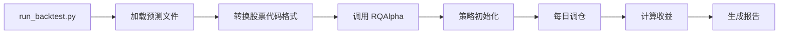

# RQAlpha 回测使用指南

本文档详细说明如何使用 RQAlpha 框架进行真实 T+1 交易回测。

## 1. 安装 RQAlpha

```bash
pip install rqalpha
```

安装完成后，需要下载数据包（首次使用）：

```bash
rqalpha download-bundle
```

## 2. 配置文件说明

### 2.1 RQAlpha 配置文件 (`config/rqalpha_config.yaml`)

```yaml
base:
  start_date: "2018-01-01"      # 回测起始日期（可从预测文件自动推断）
  end_date: "2018-01-31"        # 回测结束日期（可从预测文件自动推断）
  initial_cash: 10000000        # 初始资金（1000万）
  benchmark: "000300.XSHG"      # 基准指数（沪深300）

commission:
  commission_rate: 0.0003        # 手续费率（万分之3）
  min_commission: 5.0           # 最小手续费（5元）

slippage:
  slippage_rate: 0.0001          # 滑点率（万分之1）
  slippage_type: "fixed"        # 固定滑点

trading:
  day_trade: false              # T+1 交易（不允许日内交易）

risk:
  max_position: 0.3             # 最大仓位（30%）
  max_stock_weight: 0.05        # 单股最大权重（5%）
  max_industry_weight: 0.2      # 单行业最大权重（20%）
  top_k: 50                     # 每期选股数量
```

### 2.2 关键参数说明

- **手续费**：`commission_rate: 0.0003` 表示买入和卖出都收取 0.03% 手续费
- **滑点**：`slippage_rate: 0.0001` 表示交易时额外承担 0.01% 的滑点成本
- **T+1 交易**：`day_trade: false` 确保当日买入的股票次日才能卖出

## 3. 使用方法

### 3.1 基本用法

```bash
python run_backtest.py \
    --config config/pipeline.yaml \
    --use-rqalpha \
    --rqalpha-config config/rqalpha_config.yaml
```

### 3.2 指定预测文件

```bash
python run_backtest.py \
    --config config/pipeline.yaml \
    --use-rqalpha \
    --rqalpha-config config/rqalpha_config.yaml \
    --prediction data/predictions/pred_20220930_2018-01-01_2018-01-31.csv
```

### 3.3 带行业约束

```bash
python run_backtest.py \
    --config config/pipeline.yaml \
    --use-rqalpha \
    --rqalpha-config config/rqalpha_config.yaml \
    --industry data/industry.csv
```

## 4. 工作流程



### 4.1 代码格式转换

RQAlpha 使用不同的股票代码格式：
- Qlib 格式：`SH600000`, `SZ000001`
- RQAlpha 格式：`600000.XSHG`, `000001.XSHE`

系统会自动转换代码格式。

### 4.2 策略执行流程

1. **初始化**（`init`）：
   - 加载预测信号文件
   - 转换股票代码格式
   - 订阅所有可能交易的股票

2. **开盘前**（`before_market_open`）：
   - 读取当日预测信号
   - 构建目标组合权重（Top-K + 约束）

3. **开盘时**（`market_open`）：
   - 计算当前持仓
   - 计算调仓量
   - 执行交易（RQAlpha 自动处理 T+1、手续费、滑点）

4. **收盘后**（`after_market_close`）：
   - 记录持仓信息（可选）

## 5. 输出结果

RQAlpha 回测结果保存在 `data/backtest/rqalpha/` 目录：

- `report.json`：回测摘要报告（包含总收益、年化收益、夏普比率、最大回撤等）
- `summary.json`：详细统计指标
- 其他 RQAlpha 生成的报告文件

## 6. 与简化回测的对比

| 特性 | 简化回测 | RQAlpha 回测 |
|------|---------|-------------|
| 交易成本 | ❌ 无 | ✅ 手续费 + 滑点 |
| T+1 限制 | ❌ 无 | ✅ 严格执行 |
| 持仓连续性 | ❌ 无 | ✅ 有 |
| 交易价格 | ❌ 使用标签收益 | ✅ 使用真实行情 |
| 执行速度 | ✅ 快 | ⚠️ 较慢 |
| 适用场景 | 信号验证 | 真实交易评估 |

## 7. 常见问题

### 7.1 股票代码转换失败

**问题**：某些股票代码无法转换

**解决**：检查预测文件中的代码格式，确保为 `SH` 或 `SZ` 开头。

### 7.2 数据缺失

**问题**：RQAlpha 提示某些日期无数据

**解决**：
1. 运行 `rqalpha download-bundle` 下载数据
2. 检查回测日期范围是否在数据范围内
3. 某些股票可能已退市，系统会自动跳过

### 7.3 交易失败

**问题**：某些股票无法交易

**解决**：
- 检查股票是否停牌
- 检查是否在交易时间
- 检查资金是否充足

## 8. 策略自定义

如需自定义交易策略，可修改 `backtest/rqalpha_strategy.py`：

- `build_portfolio()`：修改组合构建逻辑
- `rebalance_portfolio()`：修改调仓逻辑
- `before_market_open()`：添加开盘前检查
- `market_open()`：修改交易执行逻辑

## 9. 性能优化建议

1. **减少订阅股票数量**：只订阅可能交易的股票
2. **批量交易**：使用 `order_target_percent` 而非逐只下单
3. **减少调仓频率**：设置最小权重变化阈值，避免频繁调仓

## 10. 扩展阅读

- RQAlpha 官方文档：https://rqalpha.readthedocs.io/
- 策略开发指南：参考 `backtest/rqalpha_strategy.py` 中的注释

