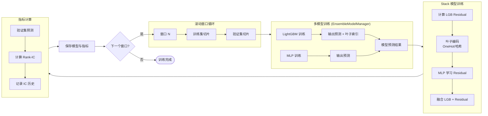
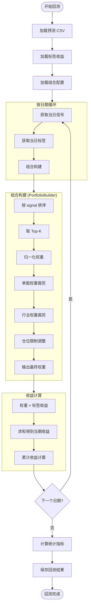
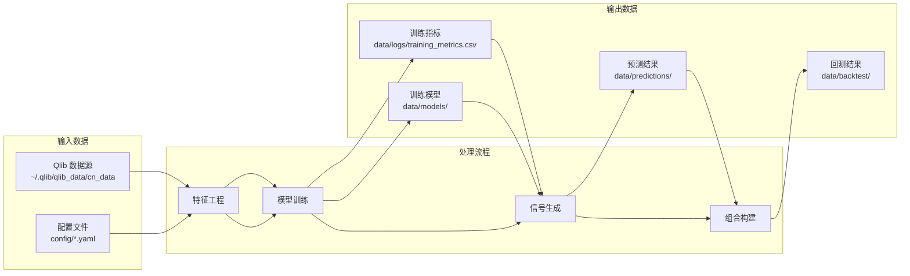
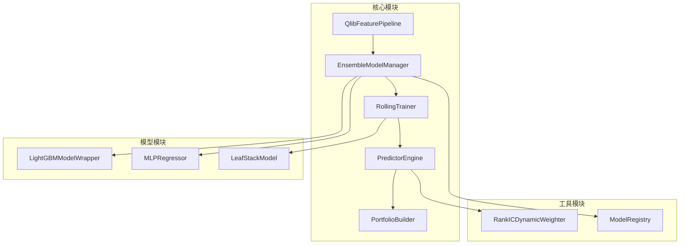
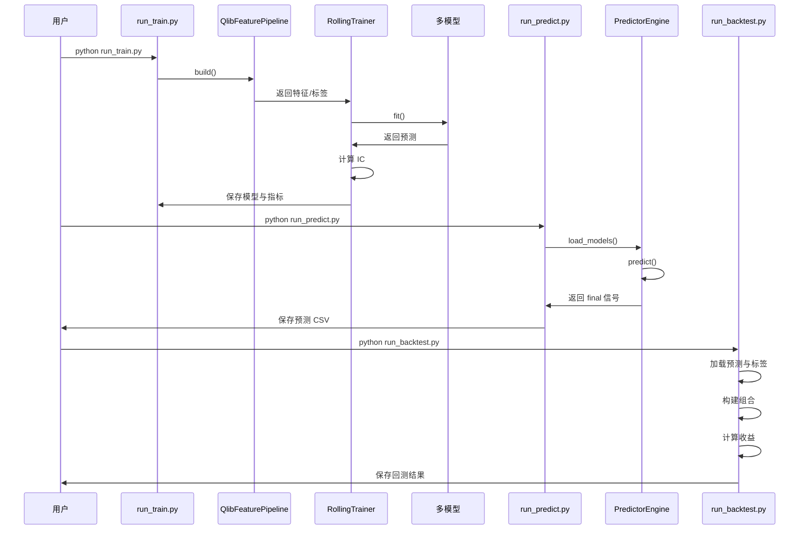
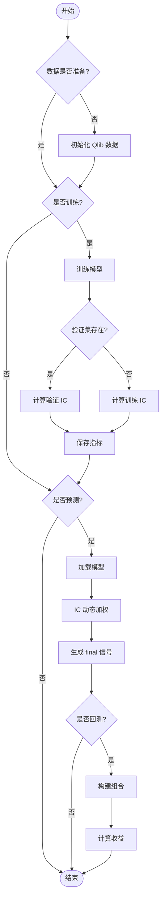

# 工程流程图

本文档以流程图形式展示系统的完整工作流程，从数据准备到最终回测的全链路。

## 1. 整体架构流程图

```mermaid
graph TB
    Start([开始]) --> Config[加载配置文件]
    Config --> DataPrep[数据准备阶段]
    DataPrep --> Train[训练阶段]
    Train --> Predict[预测阶段]
    Predict --> Backtest[回测阶段]
    Backtest --> End([结束])
    
    subgraph DataPrep["数据准备 (QlibFeaturePipeline)"]
        D1[初始化 Qlib] --> D2[提取特征 D.features]
        D2 --> D3[提取标签 Ref($close,-5)/$close-1]
        D3 --> D4[特征标签对齐]
        D4 --> D5[标准化处理]
        D5 --> D6[输出 DataFrame/Series]
    end
    
    subgraph Train["训练阶段 (RollingTrainer)"]
        T1[生成滚动窗口] --> T2[切片训练/验证集]
        T2 --> T3[训练多模型]
        T3 --> T4[计算验证 IC]
        T4 --> T5[保存模型与指标]
        T5 --> T6{是否还有窗口?}
        T6 -->|是| T1
        T6 -->|否| T7[生成 training_metrics.csv]
    end
    
    subgraph Predict["预测阶段 (PredictorEngine)"]
        P1[加载历史 IC] --> P2[加载多模型]
        P2 --> P3[提取预测期特征]
        P3 --> P4[多模型预测]
        P4 --> P5[IC 动态加权]
        P5 --> P6[生成 final 信号]
        P6 --> P7[保存预测 CSV]
    end
    
    subgraph Backtest["回测阶段 (run_backtest)"]
        B1[加载预测结果] --> B2[加载标签收益]
        B2 --> B3[按日期循环]
        B3 --> B4[组合构建]
        B4 --> B5[计算当期收益]
        B5 --> B6{是否还有日期?}
        B6 -->|是| B3
        B6 -->|否| B7[计算绩效指标]
        B7 --> B8[保存回测结果]
    end
```

## 2. 训练阶段详细流程



## 3. 预测阶段详细流程

```mermaid
graph TB
    Start([开始预测]) --> LoadIC[加载 training_metrics.csv]
    LoadIC --> LoadModels[加载多模型]
    LoadModels --> ExtractFeat[提取预测期特征]
    
    subgraph MultiModel["多模型预测"]
        MM1[LightGBM 预测] --> MM2[输出 lgb_pred + leaf]
        MM3[MLP 预测] --> MM4[输出 mlp_pred]
        MM2 --> MM5[Stack 预测]
        MM5 --> MM6[输出 stack_pred]
        MM4 --> MM7[模型预测集合]
        MM6 --> MM7
    end
    
    subgraph QlibEnsemble["Qlib Ensemble (可选)"]
        QE1[标准化各模型预测] --> QE2[平均融合]
        QE2 --> QE3[输出 qlib_ensemble]
    end
    
    subgraph ICWeight["IC 动态加权"]
        IC1[读取历史 IC 序列] --> IC2[计算 IC-IR<br/>半衰期加权]
        IC2 --> IC3[权重归一化<br/>min/max 裁剪]
        IC3 --> IC4[生成权重字典]
    end
    
    ExtractFeat --> MultiModel
    MM7 --> QlibEnsemble
    QlibEnsemble --> ICWeight
    ICWeight --> Blend[加权融合<br/>final = Σ(weight × pred)]
    Blend --> SavePred[保存预测 CSV]
    SavePred --> End([预测完成])
```

## 4. 回测阶段详细流程



## 5. 数据流图



## 6. 模块依赖关系



## 7. 关键文件与脚本

| 脚本/模块 | 功能 | 输入 | 输出 |
|---------|------|------|------|
| `run_train.py` | 训练入口 | `config/pipeline.yaml` | `data/models/`, `data/logs/training_metrics.csv` |
| `run_predict.py` | 预测入口 | 预测日期范围 | `data/predictions/pred_*.csv` |
| `run_backtest.py` | 回测入口 | 预测 CSV | `data/backtest/backtest_result.csv` |
| `QlibFeaturePipeline` | 特征工程 | `config/data.yaml` | 标准化特征与标签 |
| `RollingTrainer` | 滚动训练 | 特征/标签 | 模型文件 + IC 指标 |
| `PredictorEngine` | 信号生成 | 模型 + 特征 | 综合预测信号 |
| `PortfolioBuilder` | 组合构建 | 信号 + 约束 | 权重分配 |

## 8. 执行顺序



## 9. 关键决策点



---

**说明**：以上流程图使用 Mermaid 语法绘制，可在支持 Mermaid 的 Markdown 查看器中直接渲染。如需修改，请编辑对应的 Mermaid 代码块。

