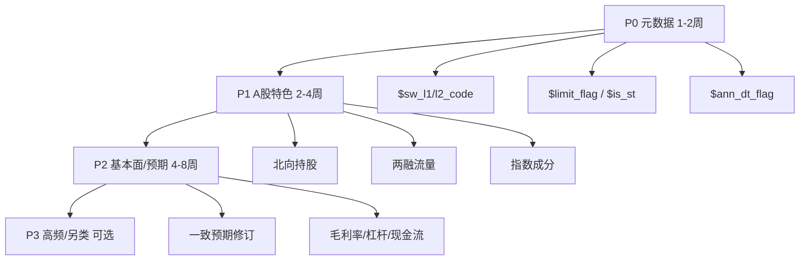

# RD-Agent 数据扩展优化 — 特征新增头脑风暴

> 生成日期：2026-05-22  
> 适用范围：`daily_pv.h5` / `scripts/regen_daily_pv.py` / `factor_lab` 宪法与 RAG  
> 关联文档：[优化清单.md](./优化清单.md) · [ARCHITECTURE_FACTOR_LAB.md](./ARCHITECTURE_FACTOR_LAB.md) · [ALPHA158_FACTOR_LIST.md](./ALPHA158_FACTOR_LIST.md)  
> 目标：为 RD-Agent 因子 loop 补齐「宪法已鼓励、数据尚未提供」的慢变量维度，提升多样性、composite 与 L3 晋级率

---

## 一、文献与框架语境

### 1.1 RD-Agent-Quant 在说什么


| 来源                                                                     | 要点                                                                             |
| ---------------------------------------------------------------------- | ------------------------------------------------------------------------------ |
| [R&D-Agent-Quant (arXiv:2505.15155)](https://arxiv.org/abs/2505.15155) | **Data-centric**：领域先验 + 可执行规范 $\mathcal{D}$（数据接口）约束 LLM；因子与模型联合优化；在 Qlib 上回测验证 |
| [microsoft/RD-Agent](https://github.com/microsoft/RD-Agent)            | `fin_factor` 场景：假设 → 代码 → qrun；另有从财报 PDF 抽因子的 FinReport 路线                     |
| 论文 **不规定** 具体列名                                                        | 实证依赖 **Qlib + 因子库（类 Alpha158）+ 真实回测**；去重（IC 相关）、换手惩罚在框架内                       |


**对本项目的含义：** 数据扩展不是「列越多越好」，而是让 **Specification（宪法 `columns`）与 `daily_pv.h5` 一致**，避免 LLM 写出无法在面板执行的 `groupby("$sw_l1_code")` 等表达式。

### 1.2 对标基线


| 基线                | 角色                                                                                    |
| ----------------- | ------------------------------------------------------------------------------------- |
| **Qlib Alpha158** | 从 OHLCV 派生约 158 个价量技术指标（K 线、ROC、MA、STD、CORR、RSI 等）— 宜由 Qlib 侧提供，**不宜在 daily_pv 重复堆叠** |
| **Barra / 多因子风格** | 行业、规模、动量、价值、质量、流动性等风格暴露                                                               |
| **A 股制度**         | T+1、涨跌停、ST、申万行业、北向、两融、指数成分                                                            |


---

## 二、现状：已有列 vs 宪法缺口

### 2.1 当前 `daily_pv.h5`（v2，约 42 列）

由 `scripts/regen_daily_pv.py` 的 `FIELDS` 生成，写入  
`git_ignore_folder/factor_implementation_source_data/daily_pv.h5`，workspace 通过 symlink 复用。


| 类别   | 已有列（节选）                                                                 |
| ---- | ----------------------------------------------------------------------- |
| 价量   | `$close`/`$open`/`$high`/`$low`，前复权 `$*_qfq`，`$vol`/`$volume`/`$amount` |
| 流动性  | `$turnover_rate`，`$turnover_rate_f`，`$volume_ratio`                     |
| 技术指标 | `$rsi_qfq_12`，`$macd_*`，`$kdj_*`，`$atr_qfq`，`$mtmma_qfq`                |
| 估值   | `$pe`，`$pe_ttm`，`$pb`，`$ps`，`$ps_ttm`，`$total_mv`，`$dv_*`               |
| 质量   | `$roe`，`$q_profit_yoy`，`$q_eps`，`$assets_turn`，`$profit_to_gr`          |
| 资金流  | `$net_amount`，`$buy_elg/lg/md/sm_amount`                                |
| 两融余额 | `$rzye`，`$rqye`                                                         |


**已排除（源数据全 NaN）：** `$factor`，`$roa`，`$roa2_yearly`。

### 2.2 宪法已声明、数据缺失（断点）

`factor_lab/config/rag_constitution.yaml` 中：

- `allowed_primitives` 含 `groupby("$sw_l1_code").transform` — **但 `columns` 未列出 `$sw_l1_code`**
- `encouraged_families` 含 industry_relative、overnight_info、margin_direction、long_momentum 等 — **部分仅能用现有列近似，无法严格实现**

### 2.3 v19 池缺口（与 [优化清单 §九](./优化清单.md) 一致）


| 优先级 | 家族                          | 当前状态    | 数据依赖                                   |
| --- | --------------------------- | ------- | -------------------------------------- |
| ★★★ | industry_relative           | **0 个** | `$sw_l1_code`（或二级）                     |
| ★★★ | earnings_quality / revision | 仅 1 个   | `$ann_dt_flag`、一致预期修订等                 |
| ★★  | long_momentum W=90/120      | **0 个** | 现有价量可算；残差动量需指数收益                       |
| ★★  | overnight_info              | **0 个** | 可用 open/prev_close；事件过滤需 `$limit_flag` |
| ★   | margin_direction            | 间接      | 两融**流量**优于静态余额                         |


### 2.4 流水线位置

```text
daily_pv.h5（~42 列，regen_daily_pv.py FIELDS）
  → CoSTEER 子 workspace: factor.py → result.h5
  → process_factor_data() 合并列
  → [可选] filter_new_factors_panel() 按列 Rank IC 预筛选
  → combined_factors_df.parquet
  → qrun conf_combined_factors.yaml（重，约 3–10 min/因子）
  → read_exp_res.py → qlib_res.csv（composite, diversity_bonus, enhanced_score）
```

数据扩展主要影响 **前段**：扩大 LLM 可引用列、减少「幻觉列名」与全 NaN 列。

---

## 三、新增特征头脑风暴（按优先级）

### 3.1 P0 — 元数据与可交易性（★★★，1–2 周）

**解锁行业中性、事件因子、样本一致性；成本低、收益最大。**


| 建议字段                                      | 说明         | 解锁的因子方向                           |
| ----------------------------------------- | ---------- | --------------------------------- |
| `**$sw_l1_code`**                         | 申万一级行业代码   | 行业内 PE/PB/动量 zscore、行业动量差、质量行业内排名 |
| `**$sw_l2_code**`（可选）                     | 申万二级       | 更细粒度行业内比较                         |
| `**$limit_flag` / `$price_limit_status**` | 涨跌停或触及涨停状态 | 涨停溢价、连板情绪、可交易性过滤                  |
| `**$is_st**`                              | 是否 ST      | 剔除不可交易、风险截面                       |
| `**$list_days**`                          | 上市交易日数     | 次新效应、流动性分层                        |
| `**$ann_dt_flag` / `$report_date**`       | 财报披露日      | 盈余公告后漂移、盈利修正、防前视                  |


**文献/实践：** Barra 行业因子；A 股涨跌停与 PEAD；宪法 `groupby("$sw_l1_code")` 的硬前提。

---

### 3.2 P1 — A 股特色与方向性资金（★★☆，2–4 周）


| 类别                              | 建议新增列                                                        | 因子方向示例                      |
| ------------------------------- | ------------------------------------------------------------ | --------------------------- |
| **北向/互联互通**                     | `$hk_hold_ratio`，`$hk_hold_chg_5d`，`$hk_net_buy`             | 外资持股变化、北向净流入强度（需与日频对齐、处理缺失） |
| **两融流量**（已有 `$rzye`/`$rqye` 余额） | `$rzmre` 融资买入，`$rzche` 偿还，`$rqmcl` 融券卖出，派生 `$margin_net_buy` | 净融资买入、融券压力变化；比静态余额更「有方向」    |
| **指数成分**                        | `$in_hs300`，`$in_zz500`，`$in_zz1000`                         | 指数增强中性、风格暴露控制               |
| **市场状态**                        | `$index_ret_1d`（沪深300/中证500）                                 | 残差动量、条件动量（剥离市场 beta）        |


**原则：** 慢变、与 volume 族低相关；配合 `ffill` 与 NaN 说明写入 `columns_nan_note`。

---

### 3.3 P2 — 基本面与一致预期（★★☆，4–8 周）

支撑 v19 教训：**慢基本面 + 低换手** 才能抬 composite；避免短周期量价反转。


| 建议新增                                        | 说明                        |
| ------------------------------------------- | ------------------------- |
| `**$gross_margin` / `$net_margin`**         | 盈利质量（`$profit_to_gr` 可扩展） |
| `**$debt_to_assets` / `$current_ratio**`    | 财务风险、质量筛选                 |
| `**$cfps` / 经营现金流相关**                       | 盈利质量 vs 应计                |
| `**$holder_num_chg`**                       | 股东户数变化（A 股筹码集中度常用）        |
| `**$forecast_eps_chg**`（一致预期，若有源）           | 真正的 **earnings revision** |
| `**$oper_rev_yoy`**（若 `$q_profit_yoy` 粒度不足） | 盈利加速、修正                   |


**规则：** 季度/月度字段必须在 **instrument 内 ffill**；配合 `**$ann_dt_flag`** 避免前视偏差。

---

### 3.4 P3 — 价量微观与可选另类（★☆，按需）


| 建议新增                         | 说明                      |
| ---------------------------- | ----------------------- |
| `**$vwap` / `$avg_price**`   | 均价偏离、日内结构 proxy         |
| `**$adj_factor**`            | 复权因子显式列，减少 LLM 误用未复权价   |
| `**$float_mv` / `$circ_mv**` | 流通市值（与 `$total_mv` 区分）  |
| **龙虎榜** `$lhb_net_buy` 等     | 覆盖率低，适合作条件因子            |
| **情绪/热度**                    | 注意幸存者偏差与数据源稳定性          |
| **分钟聚合**                     | 偏离当前日频 RD-Agent 主路径，工程重 |


---

### 3.5 事件与可交易性补充（贯穿 P0–P1）


| 字段                                          | 用途             |
| ------------------------------------------- | -------------- |
| `**$suspend` / `$is_tradable`**             | 停牌日因子置 NaN 或剔除 |
| `**$high_limit` / `$low_limit**`            | 距离涨跌停距离、封板强度   |
| `**$auction_vol` / `$auction_px**`（若有集合竞价源） | 开盘信息、隔夜与竞价缺口   |


直接支撑宪法 **overnight_info**、低换手 regime。

---

## 四、明确不建议或慎加的项


| 类型                          | 原因                                                                              |
| --------------------------- | ------------------------------------------------------------------------------- |
| 再堆 20+ 个预计算技术指标             | 与 **Alpha158** 及现有 `$macd_qfq`/`$rsi_qfq_12` 重叠；历史 loop 短周期量价反转已证伪（换手↑、Sharpe↓） |
| `**$roa` / `$roa2_yearly`** | 源数据全 NaN，宪法已禁止                                                                  |
| `**$factor**`               | 曾 100% NaN                                                                      |
| 无 ffill 规则的季度字段             | 前视 / NaN 爆炸；必须写进 `columns_nan_note`                                             |
| 过高频 tick 未聚合                | CoSTEER/qrun 为日频；列过多加重列名错误与幻觉                                                   |


**策略一句话：**

> 价量衍生交给 **Alpha158** 或 LLM 在现有 OHLCV 上计算；**daily_pv 补慢变量、A 股制度与行业维度。**

---

## 五、实施路线图




| 波次     | 动作项               | 工程触点                                                                                        |
| ------ | ----------------- | ------------------------------------------------------------------------------------------- |
| **P0** | 行业、涨跌停/ST、披露日     | `regen_daily_pv.py` `FIELDS`；`rag_constitution.yaml` `columns`；重跑 regen + workspace symlink |
| **P1** | 北向、两融流量、指数成分、市场收益 | 确认 Qlib 字段名与 PROVIDER_URI；更新 `columns_nan_note`                                             |
| **P2** | 预期修订、质量/现金流、股东户数  | 可能需额外数据源；文档化 ffill 规则                                                                       |
| **P3** | 龙虎榜、情绪、分钟聚合       | 单独评估覆盖率与 loop 收益                                                                            |


---

## 六、与 RD-Agent 论文机制的对应


| 论文机制                                  | 数据扩展应如何配合                                                                         |
| ------------------------------------- | --------------------------------------------------------------------------------- |
| **Specification Unit（$\mathcal{D}$）** | 每加一列：同步 `rag_constitution.yaml`、`constitution.py` fallback 单测、`regen_daily_pv.py` |
| **Synthesis（领域先验）**                   | 新列映射到 `encouraged_families`（如 margin_direction、industry_relative）                 |
| **Validation（IC 去重 ≥0.99）**           | 新族宜 **慢变、与 volume 族低相关**；行业中性因子更易过                                                |
| **Factor–Model 共优化**                  | daily_pv 服务 **factor loop**；模型侧仍可用 Alpha158/360，需在文档中区分                           |
| **FinReport 场景**                      | 结构化列（预期修订）与「从 PDF 抽因子」互补                                                          |


---

## 七、落地检查清单（实施 P0 时）

- 在 Qlib `D.features` 中验证字段存在性与 NaN 比例
- 更新 `scripts/regen_daily_pv.py` → `FIELDS` / `COLUMN_NAMES`
- 更新 `factor_lab/config/rag_constitution.yaml` → `columns` + `columns_nan_note`
- 跑 `tests/factor_lab/config/test_constitution.py`（YAML 与 fallback byte-parity）
- 执行 `regen_daily_pv.py`（必要时 `--patch-workspaces`）
- 跑 3–5 轮 factor loop 验收：是否出现 industry_relative 类假设、`diversity_bonus` 是否改善
- 同步 [优化清单.md](./优化清单.md)「数据扩展」阶段状态

### 7.1 P0 字段增量草案（待 Qlib 字段名确认）

```python
# scripts/regen_daily_pv.py — 拟追加（示例名，以 qlib 实际 expression 为准）
P0_EXTRA = [
    "$sw_l1_code",
    "$limit_flag",      # 或 $price_limit_status
    "$is_st",
    "$list_days",
    "$ann_dt_flag",     # 或 $report_date
]
```

---

## 八、成功标准（与优化清单 KPI 对齐）


| 指标                             | 数据扩展后的期望                                         |
| ------------------------------ | ------------------------------------------------ |
| 因子家族覆盖                         | industry_relative、earnings_revision 等 ★★★ 族有可行实现 |
| 单 loop 有效因子率                   | ≥ 35%（配合预筛选）                                     |
| enhanced_score 优于 composite 占比 | ≥ 30%（正交因子需新族原料）                                 |
| LLM 列名错误 / 全 NaN 因子            | 下降（宪法与 h5 一致）                                    |
| LGB OOS Rank IC（生产）            | 不下降 ±0.002                                       |


---

## 九、参考文献与内部链接


| 类型  | 链接                                                                                                                                |
| --- | --------------------------------------------------------------------------------------------------------------------------------- |
| 论文  | [R&D-Agent-Quant arXiv:2505.15155](https://arxiv.org/abs/2505.15155)                                                              |
| 代码  | [microsoft/RD-Agent](https://github.com/microsoft/RD-Agent)                                                                       |
| 项目  | `scripts/regen_daily_pv.py`，`factor_lab/config/rag_constitution.yaml`，`factor_lab/rag_db/academic_factors/ashare_high_value.yaml` |
| 清单  | [优化清单.md §九 v19 缺口](./优化清单.md)                                                                                                    |


---

## 十、变更日志


| 日期         | 版本   | 变更                                   |
| ---------- | ---- | ------------------------------------ |
| 2026-05-22 | v1.0 | 初版：文献语境 + 现状断点 + P0–P3 特征头脑风暴 + 实施清单 |


---

*本文档随 `daily_pv` / 宪法演进更新；重大列变更请同步 `docs/优化清单.md` Phase「数据扩展」与 `FACTOR_LAB_USAGE.md`（若有时序/NaN 约定变更）。*