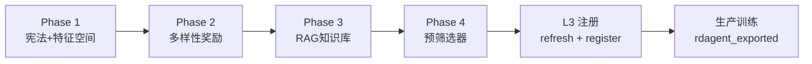

# RDAgent 因子搜索能力提升 — 优化清单

> 生成日期：2026-05-21  
> 适用范围：`factor_lab` + `rdagent_overrides` + L2/L3 因子流水线  
> 目标：提升 RDAgent 因子发现效率、多样性与生产晋级率

---

## 一、现状诊断


| 维度     | 当前状态                                             | 主要瓶颈                         |
| ------ | ------------------------------------------------ | ---------------------------- |
| 基础特征   | `daily_pv.h5` 约 22 列                             | 缺行业分类、事件标记、北向资金等 A 股特色列      |
| LLM 引导 | 静态宪法 + Alpha158 避让                               | 无文献/成功案例 RAG；embedding 常为零向量 |
| Reward | `composite = IR + 2×IC_IR - 0.5×log(1+turnover)` | 不奖励与现有池的正交性                  |
| 因子库    | v19 共 15 个认证因子                                   | 过度集中在 volume/liquidity 族     |
| 计算效率   | 每因子 qrun 约 3–10 分钟                               | 低 IC 候选仍进入完整 qrun            |
| 搜索窗口   | 原仅 {5,10,20,30,60}                               | 缺 90/120 日中长期动量空间            |


---

## 二、四阶段优化总览




| 阶段            | 周期    | 状态          | 核心收益                   |
| ------------- | ----- | ----------- | ---------------------- |
| Phase 1       | 1–2 周 | ✅ 已落地（代码）   | 扩大 LLM 搜索空间，明确 v19 缺口族 |
| Phase 2       | 1–2 周 | ✅ 已落地（代码）   | 奖励正交因子，抑制同质化           |
| Phase 3       | 2–4 周 | ✅ 已落地（代码）   | 学术因子示例注入 proposal      |
| Phase 4       | 1 周   | ✅ 已落地（默认关闭） | 过滤无效 qrun，节省 60–80% 算力 |
| 数据扩展          | 2–4 周 | ⬜ 待做        | 解锁行业相对估值等高价值族          |
| Embedding RAG | 1 月+  | ⬜ 待做        | 语义检索替代关键词匹配            |


---

## 三、已实施项（代码变更）

### 3.1 Phase 1 — 宪法与 Proposal 升级

- `factor_lab/config/rag_constitution.yaml`
  - `allowed_windows` 扩展为 `[5, 10, 20, 30, 60, 90, 120]`
  - `allowed_primitives` 增加 `skew/kurt`、行业内 `groupby`
  - `columns` 声明 `$close_qfq`、`$sw_l1_code`、`$margin_net_ratio` 等
  - `encouraged_families` 7 → 14 族（残差动量、隔夜收益、ROE 加速等）
  - `discouraged_families` 新增 Alpha158 软降权（`penalty: -1.0`）
  - `historical_lesson` 注入 v19 池多样性缺口（★★★ 优先族）
- `factor_lab/adapters/proposal.py`
  - `_ALPHA158_AVOIDANCE_HINT` 升级为三层多样性策略（硬避让 / 过代表 / 缺口优先）

### 3.2 Phase 2 — 多样性奖励

- 新建 `factor_lab/adapters/diversity_reward.py`
  - `compute_diversity_bonus()`：`weight × (1 - max_spearman_with_pool)`
  - 默认权重 `DIVERSITY_WEIGHT = 0.4`
- `rdagent_overrides/factor_template/read_exp_res.py`
  - 输出 `1day.diversity_bonus`、`1day.enhanced_score`
  - `enhanced_score = composite_score + diversity_bonus`
- `factor_lab/adapters/patch_qlib_conda.py`
  - `IMPORTANT_METRICS` 增加上述两个新指标

### 3.3 Phase 3 — RAG 知识库

- 新建 `factor_lab/rag_db/academic_factors/ashare_high_value.yaml`（14 个种子因子）
- 新建 `factor_lab/adapters/rag_retriever.py`
  - 关键词匹配检索 top-K 示例
  - 每 3 轮强制随机探索（`FACTOR_LAB_RAG_EXPLORATION_PERIOD`）
- `factor_lab/adapters/proposal.py`
  - `ProjectQlibFactorHypothesisGen.prepare_context()` 注入 RAG 块

### 3.4 Phase 4 — 预筛选器

- 新建 `factor_lab/adapters/pre_screener.py`
  - `pre_screen_result_h5()`：252 日 Rank IC 快速检验
  - 默认 **关闭**，需环境变量显式启用
- `factor_lab/adapters/experiments.py` 中 qrun 前调用预筛选（**待集成**）

---

## 四、待办清单（按优先级）

### P0 — 立即可做（本周）


| #   | 任务                                                     | 状态  | 验收标准                                        |
| --- | ------------------------------------------------------ | --- | ------------------------------------------- |
| 1   | 跑 3 轮 factor loop 验证新指标                                | ✅   | 3 轮完成（exit_code:0），3 个 workspace 均含新指标      |
| 2   | 检查 `summarize_rdagent.py` 是否展示新指标                      | ✅   | 汇总 MD 含 Enhanced / Div.Bonus 列              |
| 3   | 确认 WSL 下 `read_exp_res.py` 能 import `diversity_reward` | ✅   | `scripts/lab/_p0_wsl_import_check.py` 通过    |
| 4   | 更新 `.env` / `.env.wsl` 示例注释                            | ✅   | `.env.example` + `.env.wsl.glm.example` 已补充 |


### P1 — 数据与集成（2–4 周）


| #   | 任务                               | 文件/位置                                    | 说明                                                              |
| --- | -------------------------------- | ---------------------------------------- | --------------------------------------------------------------- |
| 5   | 扩展 `daily_pv.h5` 列               | 数据构建脚本                                   | 优先：`$sw_l1_code`、`$ann_dt_flag`、`$limit_flag`                   |
| 6   | 预筛选器接入 qrun 前                    | `factor_lab/adapters/experiments.py`     | 调用 `pre_screen_result_h5()`，REJECT 时跳过 qrun                     |
| 7   | 同步 `_FALLBACK_CONSTITUTION_TEXT` | `factor_lab/config/constitution.py`      | 跑 `tests/factor_lab/config/test_constitution.py` 保持 byte-parity |
| 8   | 将 v19 成功因子写入 RAG                 | `factor_lab/rag_db/implemented_factors/` | 正向强化示例，含 IC/composite 实测值                                       |
| 9   | 将失败 loop 因子写入 RAG 负例             | 同上或 `discouraged` 条目                     | 防止重复 propose 短周期量价反转                                            |


### P2 — 效果验证（持续）


| #   | 任务           | 命令/工具                                                       | 通过条件                              |
| --- | ------------ | ----------------------------------------------------------- | --------------------------------- |
| 10  | 跑 Profile 矩阵 | `scripts/run_rdagent_profile_matrix.ps1`                    | 至少 1 个新族通过 L2 default             |
| 11  | 刷新合并 parquet | `python scripts/refresh_rdagent_parquet.py`                 | 新因子 coverage ≥ 85%                |
| 12  | L2 验证        | `factor_validation` default profile                         | `pass_threshold ≥ 0.60`           |
| 13  | 注册 L3        | `python scripts/register_rdagent_factors.py --from-refresh` | manifest 版本 bump                  |
| 14  | 生产训练验证       | `run_train_csi101.py`                                       | `rdagent_exported` 特征集 OOS IC 不下降 |
| 15  | 多样性审计        | 自定义脚本                                                       | v20 池 ≥ 3 个不同 family              |


### P3 — 长期升级（1 月+）


| #   | 任务               | 技术选型                                                               | 预期收益                 |
| --- | ---------------- | ------------------------------------------------------------------ | -------------------- |
| 16  | 本地 Embedding RAG | `BAAI/bge-small-zh-v1.5` 或 `paraphrase-multilingual-MiniLM-L12-v2` | 语义检索，替代关键词匹配         |
| 17  | 修复 Embedding API | 配置 `OPENAI_API_KEY` 或本地 embedding 服务                               | RD-Agent 知识图谱 RAG 恢复 |
| 18  | GP 符号回归预生成       | `gplearn` + 训练集                                                    | top-50 表达式作为 LLM 起点  |
| 19  | 多目标 Pareto 选择    | NSGA-II on {IC_IR, turnover, diversity}                            | 避免单标量 composite 局部最优 |
| 20  | 行业中性化因子族批量生成     | `$sw_l1_code` groupby 模板                                           | 填补 v19 行业相对估值空白      |


---

## 五、环境变量速查

在 `.env` 或 WSL 环境中配置：

```bash
# ── 已有（RD-Agent 核心）────────────────────────────────────────
QLIB_FACTOR_HYPOTHESIS_GEN=factor_lab.adapters.proposal.ProjectQlibFactorHypothesisGen
QLIB_FACTOR_HYPOTHESIS2EXPERIMENT=factor_lab.adapters.proposal.ProjectQlibFactorHypothesis2Experiment

# ── Phase 2：多样性奖励 ─────────────────────────────────────────
FACTOR_LAB_DIVERSITY_WEIGHT=0.4          # diversity_bonus 权重，0=关闭
FACTOR_LAB_CERTIFIED_PARQUET=git_ignore_folder/combined_factors_df.parquet

# ── Phase 3：RAG 检索 ───────────────────────────────────────────
FACTOR_LAB_RAG_MAX_EXAMPLES=3            # 每轮注入示例数
FACTOR_LAB_RAG_EXPLORATION_PERIOD=3      # 每 N 轮强制随机探索

# ── Phase 4：预筛选（默认关闭）──────────────────────────────────
FACTOR_LAB_PRESCREENER_ENABLED=1         # 1=启用，空=关闭
FACTOR_LAB_PRESCREENER_MIN_IC=0.005      # 最低 |Rank IC|

# ── 性能调优（已有）──────────────────────────────────────────────
FACTOR_LAB_COSTEER_MAX_LOOP=4
FACTOR_LAB_MAX_N_EPOCHS=20
```

---

## 六、推荐运行流程

```bash
# 1. 跑因子循环（建议 loop_n ≥ 5 以观察多样性效果）
python -m factor_lab.runners.rdagent_loop --mode factor --loop_n 5

# 2. 汇总本轮结果
python scripts/summarize_rdagent.py

# 3. 刷新全池 parquet + 筛选
python scripts/refresh_rdagent_parquet.py

# 4. 注册到 L3
python scripts/register_rdagent_factors.py --from-refresh

# 5. L2 验证（可选，对新候选）
# python -m factor_validation.orchestrator --profile default --factor <name>
```

---

## 七、关键文件索引


| 路径                                                          | 职责                                |
| ----------------------------------------------------------- | --------------------------------- |
| `factor_lab/config/rag_constitution.yaml`                   | LLM 静态宪法（窗口/列/家族/奖惩）              |
| `factor_lab/adapters/proposal.py`                           | Hypothesis 生成 + RAG 注入 + 多样性 hint |
| `factor_lab/adapters/diversity_reward.py`                   | 正交性奖励计算                           |
| `factor_lab/adapters/rag_retriever.py`                      | 学术因子 RAG 检索                       |
| `factor_lab/adapters/pre_screener.py`                       | qrun 前 IC 预筛选                     |
| `factor_lab/adapters/patch_qlib_conda.py`                   | WSL/conda/reward 补丁               |
| `rdagent_overrides/factor_template/read_exp_res.py`         | composite + enhanced_score 写出     |
| `factor_lab/rag_db/academic_factors/ashare_high_value.yaml` | 14 个 A 股种子因子                      |
| `factor_validation/profiles/default.yaml`                   | L2 晋级门槛                           |
| `factor_registry/data/manifest.json`                        | L3 认证因子注册表                        |
| `config/factor_lab.yaml`                                    | L1 全局开关与时间窗                       |
| `scripts/summarize_rdagent.py`                              | 人工审阅 Markdown 报告                  |


---

## 八、成功指标（KPI）


| 指标                                | 基线（v19）              | 目标（3 个月后）        |
| --------------------------------- | -------------------- | ---------------- |
| 认证因子数                             | 15                   | ≥ 22             |
| 因子家族覆盖                            | 主要是 liquidity/volume | ≥ 5 个 family     |
| 单 loop 有效因子率                      | ~20%                 | ≥ 35%            |
| 平均 qrun 耗时/loop                   | ~90 min              | ≤ 45 min（预筛选启用后） |
| 新因子 marginal IC（L2）               | —                    | ≥ 0.008          |
| LGB OOS Rank IC（生产）               | 当前 pipeline 值        | 不下降 ±0.002       |
| enhanced_score 优于 composite 的因子占比 | —                    | ≥ 30%            |


---

## 九、v19 池缺口速查（LLM 应优先填补）


| 优先级 | 家族                          | 当前状态    | 推荐方向                           |
| --- | --------------------------- | ------- | ------------------------------ |
| ★★★ | earnings_quality / revision | 仅 1 个   | ROE 加速、盈利修正、PEG                |
| ★★★ | industry_relative           | **0 个** | 行业内 PE zscore（需 `$sw_l1_code`） |
| ★★  | long_momentum W=90/120      | **0 个** | 残差动量、skip-1-month              |
| ★★  | overnight_info              | **0 个** | open/prev_close 滚动均值           |
| ★   | margin_direction            | 间接      | 净融资比率趋势、融券压力                   |


**已过代表（避免重复 propose）：**  
volume_ratio 变体、turnover 变体、amihud 水平值变体。

---

## 十、风险与回滚


| 风险                               | 缓解措施                                   | 回滚方式                                |
| -------------------------------- | -------------------------------------- | ----------------------------------- |
| diversity_bonus 导致高分但低 IC 因子晋级   | 保持 L2 `min_rank_ic=0.012` 硬门槛          | `FACTOR_LAB_DIVERSITY_WEIGHT=0`     |
| RAG 示例导致 LLM 抄袭                  | prompt 标明 "inspiration NOT copy-paste" | 删除 `rag_retriever` 调用               |
| 预筛选误杀好因子                         | 阈值从 0.005 起步，逐步调高                      | `FACTOR_LAB_PRESCREENER_ENABLED=` 空 |
| constitution YAML 与 fallback 不一致 | 跑 constitution 单测                      | 恢复 `_FALLBACK_CONSTITUTION_TEXT`    |
| WSL import diversity_reward 失败   | read_exp_res fail-open 返回 0            | 检查 `sys.path` 注入                    |


---

## 十一、变更日志


| 日期         | 版本   | 变更                        |
| ---------- | ---- | ------------------------- |
| 2026-05-21 | v1.0 | 初版：四阶段方案 + 已实施/待办清单 + KPI |


---

*本文档随 `factor_lab` 演进持续更新。重大架构变更请同步 `docs/ARCHITECTURE_FACTOR_LAB.md`。*